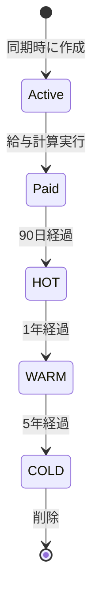
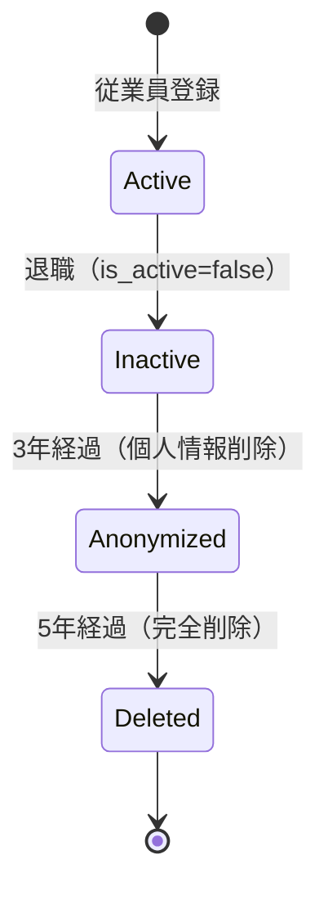

# データ保持・削除ポリシー

- バージョン: 1.0
- 作成日: 2025年12月30日
- 最終更新日: 2025年12月30日
- 作成者: Project Manager

---

## 1. 概要

本ドキュメントは、勤怠管理システムにおけるデータの保持期間、削除方法、アーカイブ戦略を定義する。個人情報保護法、労働基準法などの法令遵守と、システムのパフォーマンス維持を両立させる。

## 2. 法的要件

### 2.1. 労働基準法

**第109条**: 労働関係に関する重要な書類は**3年間保存**義務

- 対象: 労働者名簿、賃金台帳、出勤簿など
- 本システムでの該当データ: `work_records`, `payroll_histories`

### 2.2. 個人情報保護法

**第22条**: 利用目的を達成した後は、個人データを**遅滞なく消去**するよう努める

- 退職者、卒業生のデータは適切な期間経過後に削除

### 2.3. 本システムの方針

法令遵守と監査要件を考慮し、以下の保持期間を設定する:

- **給与関連データ**: **5年間**保持（労働基準法の3年 + 余裕2年）
- **監査ログ**: **5年間**保持（内部統制要件）
- **個人情報**: 退職後**3年間**保持、その後削除

---

## 3. データ保持期間一覧

### 3.1. テーブル別保持期間

| テーブル | 保持期間 | 削除方法 | 理由 |
|---------|---------|---------|------|
| **employees** | 退職後3年 | 論理削除 → 物理削除 | 個人情報保護法 |
| **work_records** | 5年 | アーカイブ → 削除 | 労働基準法、監査要件 |
| **payroll_histories** | 5年 | アーカイブ → 削除 | 労働基準法、監査要件 |
| **audit_logs** | 5年 | 削除 | 内部統制要件 |
| **batch_job_histories** | 1年 | 削除 | 運用履歴 |
| **work_types** | 永続 | なし | マスタデータ |
| **students** | 卒業後3年 | 論理削除 → 物理削除 | 個人情報保護 |
| **student_levels** | 永続 | なし | マスタデータ |
| **hourly_wages** | 永続 | なし | マスタデータ（履歴管理） |

### 3.2. ログデータ保持期間

| ログ種別 | HOT期間 | WARM期間 | COLD期間 | 削除 |
|---------|---------|----------|----------|------|
| **アプリケーションログ** | 90日 | - | - | 90日後 |
| **エラーログ** | 180日 | - | - | 180日後 |
| **監査ログ** | 90日 | 1年 | 5年 | 5年後 |

---

## 4. データライフサイクル

### 4.1. work_records（勤務記録）



**各ステージの詳細**:

1. **Active（アクティブ）**: 0-90日
   - **保存場所**: PostgreSQL（プライマリDB）
   - **アクセス**: 高速、頻繁
   - **用途**: 給与計算、レポート生成

2. **HOT（ホット）**: 91日-1年
   - **保存場所**: PostgreSQL（プライマリDB）
   - **アクセス**: 中速、まれ
   - **用途**: 過去の給与確認、監査

3. **WARM（ウォーム）**: 1年-5年
   - **保存場所**: Amazon S3 Standard-IA
   - **アクセス**: 低速、非常にまれ
   - **用途**: 監査、法令遵守
   - **フォーマット**: JSON (Parquet圧縮)

4. **COLD（コールド）**: 5年以降
   - **保存場所**: 削除
   - **理由**: 法的保持義務終了

### 4.2. employees（従業員）



**各ステージの詳細**:

1. **Active**: 在職中
   - `is_active = TRUE`
   - すべての情報を保持

2. **Inactive**: 退職後0-3年
   - `is_active = FALSE`
   - すべての情報を保持（給与記録との関連性維持）

3. **Anonymized**: 退職後3-5年
   - 個人情報を匿名化
   - `name` → "退職者[ID]"
   - `email` → "deleted_[ID]@example.com"
   - 給与記録は保持（employee_idで関連付け）

4. **Deleted**: 退職後5年以降
   - レコードを完全削除
   - 関連する`work_records`, `payroll_histories`も削除

---

## 5. 自動削除・アーカイブジョブ

### 5.1. WorkRecordArchiveJob

**目的**: 1年以上前の勤務記録をS3にアーカイブし、DBから削除

**スケジュール**: 毎月1日 3:00

**処理フロー**:

```java
@Scheduled(cron = "0 0 3 1 * *", zone = "Asia/Tokyo")
public void execute() {
    Instant cutoffDate = Instant.now().minus(365, ChronoUnit.DAYS);

    // 1. 対象レコードを取得
    List<WorkRecord> records = workRecordRepository
        .findByCreatedAtBefore(cutoffDate);

    // 2. S3にアーカイブ
    String s3Key = "archives/work_records/" +
                   LocalDate.now().getYear() + "/" +
                   LocalDate.now().getMonthValue() + "/work_records.json.gz";

    s3Service.uploadCompressed(s3Key, convertToJson(records));

    // 3. DBから削除
    workRecordRepository.deleteAll(records);

    log.info("Archived work records",
        kv("count", records.size()),
        kv("s3Key", s3Key)
    );
}
```

### 5.2. EmployeeAnonymizationJob

**目的**: 退職後3年経過した従業員の個人情報を匿名化

**スケジュール**: 毎週日曜 5:00

```java
@Scheduled(cron = "0 0 5 * * SUN", zone = "Asia/Tokyo")
public void execute() {
    Instant cutoffDate = Instant.now().minus(1095, ChronoUnit.DAYS);  // 3年前

    List<Employee> employees = employeeRepository
        .findByIsActiveFalseAndUpdatedAtBefore(cutoffDate);

    for (Employee employee : employees) {
        employee.setName("退職者" + employee.getId());
        employee.setEmail("deleted_" + employee.getId() + "@example.com");
        employee.setGoogleRefreshTokenEncrypted(null);

        employeeRepository.save(employee);

        log.info("Employee anonymized",
            kv("employeeId", employee.getId())
        );
    }
}
```

### 5.3. EmployeeDeletionJob

**目的**: 退職後5年経過した従業員を完全削除

**スケジュール**: 毎月1日 4:00

```java
@Scheduled(cron = "0 0 4 1 * *", zone = "Asia/Tokyo")
@Transactional
public void execute() {
    Instant cutoffDate = Instant.now().minus(1825, ChronoUnit.DAYS);  // 5年前

    List<Employee> employees = employeeRepository
        .findByIsActiveFalseAndUpdatedAtBefore(cutoffDate);

    for (Employee employee : employees) {
        // 1. 関連する勤務記録を削除（または既にアーカイブ済み）
        workRecordRepository.deleteByEmployeeId(employee.getId());

        // 2. 関連する給与履歴を削除（または既にアーカイブ済み）
        payrollHistoryRepository.deleteByEmployeeId(employee.getId());

        // 3. 従業員レコードを削除
        employeeRepository.delete(employee);

        log.info("Employee deleted",
            kv("employeeId", employee.getId())
        );
    }
}
```

### 5.4. AuditLogCleanupJob

**目的**: 5年以上前の監査ログを削除

**スケジュール**: 毎週日曜 4:00

```java
@Scheduled(cron = "0 0 4 * * SUN", zone = "Asia/Tokyo")
public void execute() {
    Instant cutoffDate = Instant.now().minus(1825, ChronoUnit.DAYS);  // 5年前

    int deletedCount = auditLogRepository.deleteByChangedAtBefore(cutoffDate);

    log.info("Audit logs deleted", kv("count", deletedCount));
}
```

### 5.5. BatchJobHistoryCleanupJob

**目的**: 1年以上前のバッチジョブ履歴を削除

**スケジュール**: 毎月1日 5:00

```java
@Scheduled(cron = "0 0 5 1 * *", zone = "Asia/Tokyo")
public void execute() {
    Instant cutoffDate = Instant.now().minus(365, ChronoUnit.DAYS);  // 1年前

    int deletedCount = batchJobHistoryRepository.deleteByStartedAtBefore(cutoffDate);

    log.info("Batch job histories deleted", kv("count", deletedCount));
}
```

---

## 6. S3アーカイブ戦略

### 6.1. S3バケット構成

```
attendance-data-archive/
├── work_records/
│   ├── 2025/
│   │   ├── 01/work_records_2025-01.json.gz
│   │   ├── 02/work_records_2025-02.json.gz
│   │   └── ...
│   └── 2026/
├── payroll_histories/
│   ├── 2025/
│   └── 2026/
└── logs/
    ├── audit/
    └── application/
```

### 6.2. S3ライフサイクルポリシー

```json
{
  "Rules": [
    {
      "Id": "TransitionWorkRecordsToIA",
      "Status": "Enabled",
      "Prefix": "work_records/",
      "Transitions": [
        {
          "Days": 0,
          "StorageClass": "STANDARD_IA"
        }
      ]
    },
    {
      "Id": "TransitionAuditLogsToGlacier",
      "Status": "Enabled",
      "Prefix": "logs/audit/",
      "Transitions": [
        {
          "Days": 90,
          "StorageClass": "GLACIER"
        }
      ],
      "Expiration": {
        "Days": 1825
      }
    },
    {
      "Id": "DeleteOldWorkRecords",
      "Status": "Enabled",
      "Prefix": "work_records/",
      "Expiration": {
        "Days": 1825
      }
    }
  ]
}
```

### 6.3. アーカイブデータフォーマット

```json
{
  "archiveMetadata": {
    "tableName": "work_records",
    "archiveDate": "2026-01-01T03:00:00Z",
    "recordCount": 15234,
    "periodStart": "2024-01-01",
    "periodEnd": "2024-12-31"
  },
  "records": [
    {
      "id": 1,
      "employeeId": 42,
      "googleEventId": "abc123",
      "eventTitle": "個別（山田太郎）",
      "startTime": "2024-01-15T10:00:00Z",
      "endTime": "2024-01-15T11:30:00Z",
      "workTypeId": 1,
      "studentId": 5,
      "isPaid": true,
      "paidAt": "2024-02-01T00:00:00Z",
      "createdAt": "2024-01-15T11:35:00Z"
    }
  ]
}
```

---

## 7. データ復元手順

### 7.1. アーカイブからの復元

```java
public List<WorkRecord> restoreWorkRecords(String s3Key) {
    // 1. S3からデータ取得
    String json = s3Service.downloadAndDecompress(s3Key);

    // 2. JSONをパース
    ArchiveData archive = objectMapper.readValue(json, ArchiveData.class);

    // 3. DBに復元
    List<WorkRecord> records = archive.getRecords().stream()
        .map(this::convertToWorkRecord)
        .collect(Collectors.toList());

    workRecordRepository.saveAll(records);

    log.info("Work records restored",
        kv("s3Key", s3Key),
        kv("count", records.size())
    );

    return records;
}
```

### 7.2. 復元シナリオ

- **監査対応**: 5年以内のデータはS3から復元可能
- **法的請求**: 退職者の給与記録が必要な場合

---

## 8. GDPR（参考）

将来的にEU居住者を雇用する可能性がある場合の対応:

### 8.1. 個人データの削除要求（Right to Erasure）

```java
@Transactional
public void deletePersonalData(Integer employeeId, String reason) {
    Employee employee = employeeRepository.findById(employeeId)
        .orElseThrow(() -> new ResourceNotFoundException(...));

    // 監査ログに削除理由を記録
    auditLogRepository.save(new AuditLog(
        "employees",
        employeeId,
        "DELETE_PERSONAL_DATA",
        null,
        null,
        null,
        Instant.now(),
        reason
    ));

    // 個人情報を即座に削除
    employee.setName("削除済み");
    employee.setEmail("deleted_" + employeeId + "@example.com");
    employee.setGoogleRefreshTokenEncrypted(null);
    employee.setIsActive(false);

    employeeRepository.save(employee);
}
```

---

## 9. モニタリング

### 9.1. データ量監視

```sql
-- テーブル別のレコード数とサイズ
SELECT
    schemaname,
    tablename,
    pg_size_pretty(pg_total_relation_size(schemaname||'.'||tablename)) AS size,
    n_live_tup AS row_count
FROM pg_stat_user_tables
ORDER BY pg_total_relation_size(schemaname||'.'||tablename) DESC;
```

### 9.2. アラート設定

- `work_records`が1000万件を超えたらアラート
- `audit_logs`が500万件を超えたらアラート
- S3ストレージコストが月額$100を超えたらアラート

---

## 10. まとめ

本データ保持・削除ポリシーは以下を実現する:

1. ✅ **法令遵守**: 労働基準法、個人情報保護法に準拠
2. ✅ **自動化**: バッチジョブで自動削除・アーカイブ
3. ✅ **コスト最適化**: S3ライフサイクルポリシーで低コスト化
4. ✅ **監査対応**: 5年間のデータ保持で監査に対応可能
5. ✅ **プライバシー保護**: 退職者の個人情報を適切に削除

すべてのデータは適切な期間保持され、不要になったデータは自動的に削除される。
