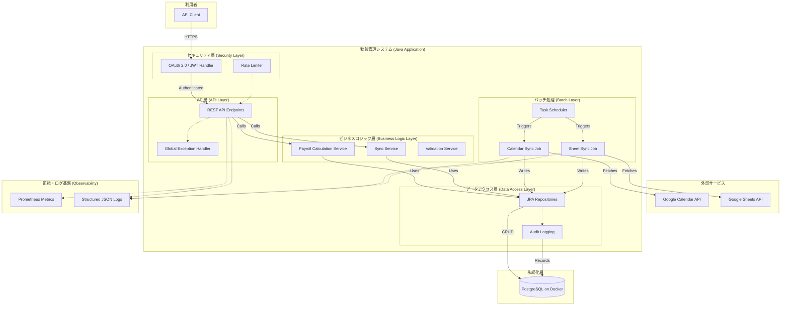
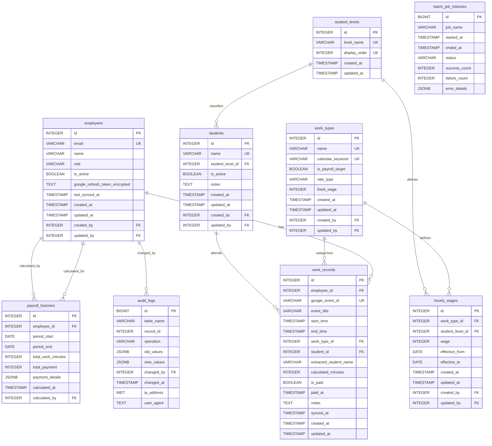

# アーキテクチャ設計書

- バージョン: 2.0
- 作成日: 2025年12月29日
- 最終更新日: 2025年12月30日
- 作成者: Project Manager

---

## 1. 概要
本ドキュメントは、「要件定義書」に基づき、当システムの高レベルなアーキテクチャ、採用技術、データモデルを定義するものである。開発者は本ドキュメントに従い、コンポーネントの実装を行う。

## 2. システムアーキテクチャ

### 2.1. 構成図
システムは、外部Googleサービスからデータを同期するバッチ処理、クライアントからの要求に応えるAPI、永続化層としてのデータベース、監視・ログ基盤から構成される。



### 2.2. コンポーネント説明
- **Java Spring Boot Application:** システムの中核。
- **REST API Endpoints:** クライアントに対して、データのCRUD操作や給与計算機能を提供するインターフェース。
- **Business Logic Layer:** 動的単価ロジックを適用した給与計算など、システムのコアなビジネスルールを実装する。
- **Data Access Layer:** Spring Data JPAを利用し、データベースへのアクセスを抽象化する。
- **Calendar Sync Job:** 定期的にGoogle Calendar APIから勤務データを取得し、DBに同期する。
- **Sheet Sync Job:** 定期的にGoogle Sheets APIから生徒マスタデータを取得し、DBに同期する。
- **Database (PostgreSQL):** アプリケーションのデータを永続的に保存する。開発・本番ともにDocker上で稼働させる。

## 3. 技術スタック

| 分類 | 技術名 | バージョン/備考 |
| :--- | :--- | :--- |
| 言語 | Java | 17 (LTS) or newer |
| フレームワーク | Spring Boot | 3.2.x or newer |
| データ永続化 | Spring Data JPA (Hibernate) | Spring Bootに準拠 |
| データベース | PostgreSQL on Docker | 15.x or newer (開発・本番共通) |
| ビルドツール | Maven | 3.9.x or newer |
| 認証 | OAuth 2.0 | Spring Security 6, Google API Client (Calendar & Sheets) |

## 4. データベース設計

### 4.1. ER図



### 4.2. テーブル定義
（詳細はER図の通り。各テーブルのカラム、型、制約を定義する）

## 5. API設計方針
- **スタイル:** RESTful原則に準拠する。
- **データフォーマット:** リクエスト/レスポンス共にJSON形式。キーは`camelCase`とする。
- **認証:** `/public` 以外のすべてのエンドポイントは、OAuth 2.0 Bearerトークンによる認証を必須とする。
- **バージョニング:** URLパスにバージョンを含める (`/api/v1/...`)。
- **エラーハンドリング:** 標準的なHTTPステータスコードを使用する。エラーレスポンスは以下のJSON形式に統一する。
  ```json
  {
    "timestamp": "2025-12-29T10:00:00.000+00:00",
    "status": 400,
    "error": "Bad Request",
    "message": "Employee ID not found"
  }
  ```

## 6. 認証フロー
当システムは、Googleの **OAuth 2.0 認可コードフロー** を利用する。
1. **認可リクエスト:** クライアントはユーザーをGoogleの同意画面にリダイレクトさせる。
2. **ユーザー同意:** ユーザーはGoogleアカウントでログインし、カレンダーへのアクセス許可に同意する。
3. **認可コード取得:** Googleは指定されたリダイレクトURIに、認可コードを付与してリダイレクトする。
4. **トークン交換:** バックエンドサーバーは受け取った認可コードを使い、Googleのトークンエンドポイントにリクエストを送り、**アクセストークン**と**リフレッシュトークン**を取得する。
5. **APIアクセス:** バックエンドはアクセストークンを用いて、ユーザーのGoogle Calendar APIにアクセスする。
6. **セッション発行:** バックエンドは独自のJWT（JSON Web Token）などを生成し、クライアントに返す。以降、クライアントは当システムのAPIを呼び出す際に、このJWTをAuthorizationヘッダーに含める。
