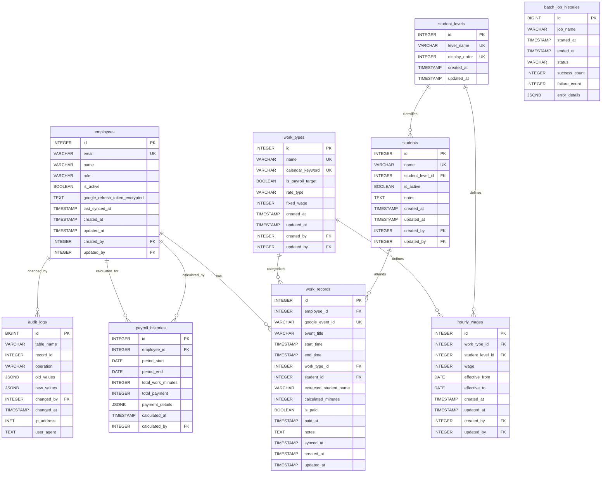

# データベース詳細設計書

- バージョン: 1.0
- 作成日: 2025年12月30日
- 最終更新日: 2025年12月30日
- 作成者: Project Manager

---

## 1. 概要

本ドキュメントは、勤怠管理システムのデータベーススキーマの完全な定義を提供する。すべてのテーブル、カラム、制約、インデックス、トリガーを包括的に記述し、実装時の指針とする。

## 2. 設計原則

### 2.1. 正規化
- 第3正規形（3NF）を基本とし、必要に応じて非正規化を検討する
- データの一貫性と整合性を最優先する

### 2.2. 監査要件
- すべてのマスタテーブルに以下の監査カラムを設ける
  - `created_at`: レコード作成日時
  - `updated_at`: レコード最終更新日時
  - `created_by`: レコード作成者（employees.idへの外部キー）
  - `updated_by`: レコード最終更新者（employees.idへの外部キー）

### 2.3. パフォーマンス
- 頻繁に検索されるカラムには適切なインデックスを設定する
- 複合キーでの検索が多い場合は複合インデックスを検討する

### 2.4. データ整合性
- 外部キー制約を積極的に使用し、参照整合性を保証する
- CHECK制約でビジネスルールを強制する

## 3. テーブル定義

### 3.1. employees（従業員テーブル）

従業員の基本情報と認証情報を管理する。

```sql
CREATE TABLE employees (
    id SERIAL PRIMARY KEY,
    email VARCHAR(255) UNIQUE NOT NULL,
    name VARCHAR(255) NOT NULL,
    role VARCHAR(20) NOT NULL DEFAULT 'USER' CHECK (role IN ('ADMIN', 'USER')),
    is_active BOOLEAN NOT NULL DEFAULT TRUE,
    google_refresh_token_encrypted TEXT,  -- AES-256-GCM暗号化
    last_synced_at TIMESTAMP,
    created_at TIMESTAMP NOT NULL DEFAULT CURRENT_TIMESTAMP,
    updated_at TIMESTAMP NOT NULL DEFAULT CURRENT_TIMESTAMP,
    created_by INTEGER REFERENCES employees(id),
    updated_by INTEGER REFERENCES employees(id)
);

-- コメント
COMMENT ON TABLE employees IS '従業員マスタテーブル';
COMMENT ON COLUMN employees.id IS '従業員ID（主キー）';
COMMENT ON COLUMN employees.email IS 'メールアドレス（一意、認証用）';
COMMENT ON COLUMN employees.name IS '従業員名';
COMMENT ON COLUMN employees.role IS 'ロール（ADMIN: 管理者, USER: 一般ユーザー）';
COMMENT ON COLUMN employees.is_active IS 'アクティブフラグ（論理削除用）';
COMMENT ON COLUMN employees.google_refresh_token_encrypted IS 'Google OAuthリフレッシュトークン（暗号化）';
COMMENT ON COLUMN employees.last_synced_at IS '最終同期日時';
COMMENT ON COLUMN employees.created_at IS '作成日時';
COMMENT ON COLUMN employees.updated_at IS '最終更新日時';
COMMENT ON COLUMN employees.created_by IS '作成者ID';
COMMENT ON COLUMN employees.updated_by IS '最終更新者ID';

-- インデックス
CREATE INDEX idx_employees_email ON employees(email);
CREATE INDEX idx_employees_active ON employees(is_active);
CREATE INDEX idx_employees_role ON employees(role);
```

### 3.2. work_types（勤務形態テーブル）

勤務の種類（個別指導、集団授業、自習室監督など）を定義する。

```sql
CREATE TABLE work_types (
    id SERIAL PRIMARY KEY,
    name VARCHAR(100) UNIQUE NOT NULL,
    calendar_keyword VARCHAR(50) UNIQUE NOT NULL,
    is_payroll_target BOOLEAN NOT NULL DEFAULT TRUE,
    rate_type VARCHAR(20) NOT NULL CHECK (rate_type IN ('FIXED', 'STUDENT_LEVEL_BASED')),
    fixed_wage INTEGER CHECK (fixed_wage IS NULL OR fixed_wage > 0),
    created_at TIMESTAMP NOT NULL DEFAULT CURRENT_TIMESTAMP,
    updated_at TIMESTAMP NOT NULL DEFAULT CURRENT_TIMESTAMP,
    created_by INTEGER REFERENCES employees(id),
    updated_by INTEGER REFERENCES employees(id),
    CONSTRAINT chk_fixed_wage_when_fixed_type
        CHECK (rate_type != 'FIXED' OR fixed_wage IS NOT NULL)
);

-- コメント
COMMENT ON TABLE work_types IS '勤務形態マスタテーブル';
COMMENT ON COLUMN work_types.id IS '勤務形態ID（主キー）';
COMMENT ON COLUMN work_types.name IS '勤務形態名';
COMMENT ON COLUMN work_types.calendar_keyword IS 'カレンダーキーワード（イベントタイトルとのマッチングに使用）';
COMMENT ON COLUMN work_types.is_payroll_target IS '給与計算対象フラグ';
COMMENT ON COLUMN work_types.rate_type IS '単価タイプ（FIXED: 固定単価, STUDENT_LEVEL_BASED: 生徒レベル別単価）';
COMMENT ON COLUMN work_types.fixed_wage IS '固定単価（rate_type=FIXEDの場合に使用）';

-- インデックス
CREATE INDEX idx_work_types_keyword ON work_types(calendar_keyword);
CREATE INDEX idx_work_types_payroll_target ON work_types(is_payroll_target);
```

### 3.3. student_levels（学校種別テーブル）

生徒の学校種別（小学生、中学生、高校生など）を管理する。

```sql
CREATE TABLE student_levels (
    id SERIAL PRIMARY KEY,
    level_name VARCHAR(50) UNIQUE NOT NULL,
    display_order INTEGER NOT NULL,
    created_at TIMESTAMP NOT NULL DEFAULT CURRENT_TIMESTAMP,
    updated_at TIMESTAMP NOT NULL DEFAULT CURRENT_TIMESTAMP
);

-- コメント
COMMENT ON TABLE student_levels IS '学校種別マスタテーブル';
COMMENT ON COLUMN student_levels.id IS '学校種別ID（主キー）';
COMMENT ON COLUMN student_levels.level_name IS '学校種別名（小学生、中学生、高校生など）';
COMMENT ON COLUMN student_levels.display_order IS '表示順序';

-- インデックス
CREATE UNIQUE INDEX idx_student_levels_order ON student_levels(display_order);
```

### 3.4. students（生徒テーブル）

生徒の基本情報を管理する。Googleスプレッドシートから同期される。

```sql
CREATE TABLE students (
    id SERIAL PRIMARY KEY,
    name VARCHAR(100) UNIQUE NOT NULL,
    student_level_id INTEGER NOT NULL REFERENCES student_levels(id),
    is_active BOOLEAN NOT NULL DEFAULT TRUE,
    notes TEXT,
    created_at TIMESTAMP NOT NULL DEFAULT CURRENT_TIMESTAMP,
    updated_at TIMESTAMP NOT NULL DEFAULT CURRENT_TIMESTAMP,
    created_by INTEGER REFERENCES employees(id),
    updated_by INTEGER REFERENCES employees(id)
);

-- コメント
COMMENT ON TABLE students IS '生徒マスタテーブル';
COMMENT ON COLUMN students.id IS '生徒ID（主キー）';
COMMENT ON COLUMN students.name IS '生徒名（一意）';
COMMENT ON COLUMN students.student_level_id IS '学校種別ID';
COMMENT ON COLUMN students.is_active IS 'アクティブフラグ（卒業生は false）';
COMMENT ON COLUMN students.notes IS '備考';

-- インデックス
CREATE INDEX idx_students_name ON students(name);
CREATE INDEX idx_students_level ON students(student_level_id);
CREATE INDEX idx_students_active ON students(is_active);
```

### 3.5. hourly_wages（時給マスタテーブル）

勤務形態と生徒レベルの組み合わせに対する時給を管理する。

```sql
CREATE TABLE hourly_wages (
    id SERIAL PRIMARY KEY,
    work_type_id INTEGER NOT NULL REFERENCES work_types(id),
    student_level_id INTEGER REFERENCES student_levels(id),
    wage INTEGER NOT NULL CHECK (wage > 0),
    effective_from DATE NOT NULL DEFAULT CURRENT_DATE,
    effective_to DATE,
    created_at TIMESTAMP NOT NULL DEFAULT CURRENT_TIMESTAMP,
    updated_at TIMESTAMP NOT NULL DEFAULT CURRENT_TIMESTAMP,
    created_by INTEGER REFERENCES employees(id),
    updated_by INTEGER REFERENCES employees(id),
    CONSTRAINT chk_effective_period CHECK (effective_to IS NULL OR effective_to >= effective_from),
    CONSTRAINT uk_wage_combination UNIQUE (work_type_id, student_level_id, effective_from)
);

-- コメント
COMMENT ON TABLE hourly_wages IS '時給マスタテーブル';
COMMENT ON COLUMN hourly_wages.id IS '時給ID（主キー）';
COMMENT ON COLUMN hourly_wages.work_type_id IS '勤務形態ID';
COMMENT ON COLUMN hourly_wages.student_level_id IS '学校種別ID（NULLの場合は勤務形態のみで単価決定）';
COMMENT ON COLUMN hourly_wages.wage IS '時給（円）';
COMMENT ON COLUMN hourly_wages.effective_from IS '適用開始日';
COMMENT ON COLUMN hourly_wages.effective_to IS '適用終了日（NULLの場合は無期限）';

-- インデックス
CREATE INDEX idx_hourly_wages_lookup ON hourly_wages(work_type_id, student_level_id);
CREATE INDEX idx_hourly_wages_effective ON hourly_wages(effective_from, effective_to);
```

### 3.6. work_records（勤務記録テーブル）

Googleカレンダーから同期された勤務記録を保存する。

```sql
CREATE TABLE work_records (
    id SERIAL PRIMARY KEY,
    employee_id INTEGER NOT NULL REFERENCES employees(id),
    google_event_id VARCHAR(255) UNIQUE NOT NULL,
    event_title VARCHAR(500) NOT NULL,
    start_time TIMESTAMP NOT NULL,
    end_time TIMESTAMP NOT NULL,
    work_type_id INTEGER REFERENCES work_types(id),
    student_id INTEGER REFERENCES students(id),
    extracted_student_name VARCHAR(100),
    calculated_minutes INTEGER GENERATED ALWAYS AS (
        EXTRACT(EPOCH FROM (end_time - start_time)) / 60
    ) STORED,
    is_paid BOOLEAN NOT NULL DEFAULT FALSE,
    paid_at TIMESTAMP,
    notes TEXT,
    synced_at TIMESTAMP NOT NULL DEFAULT CURRENT_TIMESTAMP,
    created_at TIMESTAMP NOT NULL DEFAULT CURRENT_TIMESTAMP,
    updated_at TIMESTAMP NOT NULL DEFAULT CURRENT_TIMESTAMP,
    CONSTRAINT chk_time_range CHECK (start_time < end_time),
    CONSTRAINT chk_reasonable_duration CHECK (
        EXTRACT(EPOCH FROM (end_time - start_time)) / 3600 <= 12
    )
);

-- コメント
COMMENT ON TABLE work_records IS '勤務記録テーブル';
COMMENT ON COLUMN work_records.id IS '勤務記録ID（主キー）';
COMMENT ON COLUMN work_records.employee_id IS '従業員ID';
COMMENT ON COLUMN work_records.google_event_id IS 'GoogleカレンダーイベントID（一意、重複防止用）';
COMMENT ON COLUMN work_records.event_title IS 'カレンダーイベントタイトル';
COMMENT ON COLUMN work_records.start_time IS '勤務開始時刻';
COMMENT ON COLUMN work_records.end_time IS '勤務終了時刻';
COMMENT ON COLUMN work_records.work_type_id IS '勤務形態ID（自動判定結果）';
COMMENT ON COLUMN work_records.student_id IS '生徒ID（タイトルから抽出・マッチング）';
COMMENT ON COLUMN work_records.extracted_student_name IS 'カレンダーから抽出した生徒名（マッチング失敗時の参考用）';
COMMENT ON COLUMN work_records.calculated_minutes IS '勤務時間（分、自動計算）';
COMMENT ON COLUMN work_records.is_paid IS '給与支払済みフラグ';
COMMENT ON COLUMN work_records.paid_at IS '給与支払日時';
COMMENT ON COLUMN work_records.notes IS '備考';
COMMENT ON COLUMN work_records.synced_at IS '同期日時';

-- インデックス
CREATE INDEX idx_work_records_employee ON work_records(employee_id);
CREATE INDEX idx_work_records_employee_time ON work_records(employee_id, start_time);
CREATE INDEX idx_work_records_google_event ON work_records(google_event_id);
CREATE INDEX idx_work_records_payment ON work_records(employee_id, is_paid, start_time);
CREATE INDEX idx_work_records_student ON work_records(student_id);
CREATE INDEX idx_work_records_work_type ON work_records(work_type_id);
CREATE INDEX idx_work_records_time_range ON work_records(start_time, end_time);
```

### 3.7. payroll_histories（給与計算履歴テーブル）

給与計算の実行履歴を監査目的で保存する。

```sql
CREATE TABLE payroll_histories (
    id SERIAL PRIMARY KEY,
    employee_id INTEGER NOT NULL REFERENCES employees(id),
    period_start DATE NOT NULL,
    period_end DATE NOT NULL,
    total_work_minutes INTEGER NOT NULL,
    total_payment INTEGER NOT NULL,
    payment_details JSONB NOT NULL,
    calculated_at TIMESTAMP NOT NULL DEFAULT CURRENT_TIMESTAMP,
    calculated_by INTEGER NOT NULL REFERENCES employees(id),
    CONSTRAINT chk_period CHECK (period_start <= period_end)
);

-- コメント
COMMENT ON TABLE payroll_histories IS '給与計算履歴テーブル（監査用）';
COMMENT ON COLUMN payroll_histories.id IS '履歴ID（主キー）';
COMMENT ON COLUMN payroll_histories.employee_id IS '対象従業員ID';
COMMENT ON COLUMN payroll_histories.period_start IS '計算期間開始日';
COMMENT ON COLUMN payroll_histories.period_end IS '計算期間終了日';
COMMENT ON COLUMN payroll_histories.total_work_minutes IS '総勤務時間（分）';
COMMENT ON COLUMN payroll_histories.total_payment IS '総給与額（円）';
COMMENT ON COLUMN payroll_histories.payment_details IS '給与明細（JSON形式）';
COMMENT ON COLUMN payroll_histories.calculated_at IS '計算実行日時';
COMMENT ON COLUMN payroll_histories.calculated_by IS '計算実行者ID';

-- インデックス
CREATE INDEX idx_payroll_histories_employee ON payroll_histories(employee_id);
CREATE INDEX idx_payroll_histories_period ON payroll_histories(period_start, period_end);
CREATE INDEX idx_payroll_histories_calculated ON payroll_histories(calculated_at);
```

### 3.8. audit_logs（監査ログテーブル）

すべてのデータ変更操作を記録する。

```sql
CREATE TABLE audit_logs (
    id BIGSERIAL PRIMARY KEY,
    table_name VARCHAR(50) NOT NULL,
    record_id INTEGER NOT NULL,
    operation VARCHAR(10) NOT NULL CHECK (operation IN ('INSERT', 'UPDATE', 'DELETE')),
    old_values JSONB,
    new_values JSONB,
    changed_by INTEGER REFERENCES employees(id),
    changed_at TIMESTAMP NOT NULL DEFAULT CURRENT_TIMESTAMP,
    ip_address INET,
    user_agent TEXT
);

-- コメント
COMMENT ON TABLE audit_logs IS '監査ログテーブル';
COMMENT ON COLUMN audit_logs.id IS '監査ログID（主キー）';
COMMENT ON COLUMN audit_logs.table_name IS '操作対象テーブル名';
COMMENT ON COLUMN audit_logs.record_id IS '操作対象レコードID';
COMMENT ON COLUMN audit_logs.operation IS '操作種別（INSERT, UPDATE, DELETE）';
COMMENT ON COLUMN audit_logs.old_values IS '変更前の値（JSON）';
COMMENT ON COLUMN audit_logs.new_values IS '変更後の値（JSON）';
COMMENT ON COLUMN audit_logs.changed_by IS '変更者ID';
COMMENT ON COLUMN audit_logs.changed_at IS '変更日時';
COMMENT ON COLUMN audit_logs.ip_address IS 'リクエスト元IPアドレス';
COMMENT ON COLUMN audit_logs.user_agent IS 'User-Agent';

-- インデックス
CREATE INDEX idx_audit_logs_table ON audit_logs(table_name, record_id);
CREATE INDEX idx_audit_logs_user ON audit_logs(changed_by);
CREATE INDEX idx_audit_logs_time ON audit_logs(changed_at);
CREATE INDEX idx_audit_logs_operation ON audit_logs(operation);
```

### 3.9. batch_job_histories（バッチジョブ実行履歴テーブル）

バッチ処理の実行履歴を記録し、運用監視に利用する。

```sql
CREATE TABLE batch_job_histories (
    id BIGSERIAL PRIMARY KEY,
    job_name VARCHAR(100) NOT NULL,
    started_at TIMESTAMP NOT NULL,
    ended_at TIMESTAMP,
    status VARCHAR(20) NOT NULL CHECK (status IN ('RUNNING', 'SUCCESS', 'FAILURE')),
    success_count INTEGER DEFAULT 0,
    failure_count INTEGER DEFAULT 0,
    error_details JSONB,
    CONSTRAINT chk_job_duration CHECK (ended_at IS NULL OR ended_at >= started_at)
);

-- コメント
COMMENT ON TABLE batch_job_histories IS 'バッチジョブ実行履歴テーブル';
COMMENT ON COLUMN batch_job_histories.id IS '履歴ID（主キー）';
COMMENT ON COLUMN batch_job_histories.job_name IS 'ジョブ名';
COMMENT ON COLUMN batch_job_histories.started_at IS '開始日時';
COMMENT ON COLUMN batch_job_histories.ended_at IS '終了日時';
COMMENT ON COLUMN batch_job_histories.status IS 'ステータス（RUNNING, SUCCESS, FAILURE）';
COMMENT ON COLUMN batch_job_histories.success_count IS '成功件数';
COMMENT ON COLUMN batch_job_histories.failure_count IS '失敗件数';
COMMENT ON COLUMN batch_job_histories.error_details IS 'エラー詳細（JSON）';

-- インデックス
CREATE INDEX idx_batch_jobs_name ON batch_job_histories(job_name);
CREATE INDEX idx_batch_jobs_started ON batch_job_histories(started_at);
CREATE INDEX idx_batch_jobs_status ON batch_job_histories(status);
```

## 4. トリガー

### 4.1. updated_at自動更新トリガー

すべてのマスタテーブルで、レコード更新時に `updated_at` を自動更新する。

```sql
-- トリガー関数の定義
CREATE OR REPLACE FUNCTION update_updated_at_column()
RETURNS TRIGGER AS $$
BEGIN
    NEW.updated_at = CURRENT_TIMESTAMP;
    RETURN NEW;
END;
$$ LANGUAGE plpgsql;

-- 各テーブルにトリガーを設定
CREATE TRIGGER update_employees_updated_at
    BEFORE UPDATE ON employees
    FOR EACH ROW
    EXECUTE FUNCTION update_updated_at_column();

CREATE TRIGGER update_work_types_updated_at
    BEFORE UPDATE ON work_types
    FOR EACH ROW
    EXECUTE FUNCTION update_updated_at_column();

CREATE TRIGGER update_students_updated_at
    BEFORE UPDATE ON students
    FOR EACH ROW
    EXECUTE FUNCTION update_updated_at_column();

CREATE TRIGGER update_hourly_wages_updated_at
    BEFORE UPDATE ON hourly_wages
    FOR EACH ROW
    EXECUTE FUNCTION update_updated_at_column();

CREATE TRIGGER update_work_records_updated_at
    BEFORE UPDATE ON work_records
    FOR EACH ROW
    EXECUTE FUNCTION update_updated_at_column();
```

## 5. 初期データ

### 5.1. 学校種別マスタ

```sql
INSERT INTO student_levels (level_name, display_order) VALUES
    ('小学生', 1),
    ('中学生', 2),
    ('高校生', 3);
```

### 5.2. 勤務形態マスタ（例）

```sql
INSERT INTO work_types (name, calendar_keyword, is_payroll_target, rate_type, fixed_wage) VALUES
    ('個別指導', '個別', TRUE, 'STUDENT_LEVEL_BASED', NULL),
    ('集団授業', '集団', TRUE, 'STUDENT_LEVEL_BASED', NULL),
    ('自習室監督', '自習室', TRUE, 'FIXED', 1200),
    ('ミーティング', '会議', FALSE, 'FIXED', NULL);
```

## 6. パフォーマンス最適化

### 6.1. インデックス戦略

1. **主キーインデックス**: 自動的に作成される（SERIAL型）
2. **一意制約インデックス**: UNIQUE制約により自動作成
3. **外部キーインデックス**: JOIN性能向上のため明示的に作成
4. **検索条件インデックス**: WHERE句で頻繁に使用されるカラムに作成
5. **複合インデックス**: 複数カラムでの検索が多い場合に作成

### 6.2. VACUUM・ANALYZE

```sql
-- 定期的にVACUUM・ANALYZEを実行し、統計情報を最新に保つ
VACUUM ANALYZE employees;
VACUUM ANALYZE work_records;
VACUUM ANALYZE payroll_histories;
```

## 7. バックアップ・リカバリ

### 7.1. バックアップ方針
- **日次バックアップ**: 毎日深夜にフルバックアップを取得
- **保持期間**: 30日間
- **バックアップコマンド例**:
  ```bash
  pg_dump -h localhost -U postgres -d attendance_db -F c -f backup_$(date +%Y%m%d).dump
  ```

### 7.2. リストア手順
```bash
pg_restore -h localhost -U postgres -d attendance_db -c backup_YYYYMMDD.dump
```

## 8. セキュリティ

### 8.1. アクセス制御

```sql
-- アプリケーション用ユーザーの作成
CREATE USER app_user WITH PASSWORD 'secure_password';

-- 必要最小限の権限を付与
GRANT CONNECT ON DATABASE attendance_db TO app_user;
GRANT SELECT, INSERT, UPDATE, DELETE ON ALL TABLES IN SCHEMA public TO app_user;
GRANT USAGE, SELECT ON ALL SEQUENCES IN SCHEMA public TO app_user;

-- 監査ログテーブルは読み取り専用
REVOKE INSERT, UPDATE, DELETE ON audit_logs FROM app_user;
GRANT SELECT ON audit_logs TO app_user;
```

### 8.2. データ暗号化

- `google_refresh_token_encrypted` カラムはアプリケーションレイヤーで暗号化して保存
- 暗号化アルゴリズム: AES-256-GCM
- 鍵管理: 環境変数または専用のシークレット管理サービス（AWS KMS、HashiCorp Vaultなど）

## 9. マイグレーション管理

### 9.1. Flyway使用

すべてのスキーマ変更はFlywayマイグレーションスクリプトで管理する。

```
src/main/resources/db/migration/
├── V1__initial_schema.sql
├── V2__add_audit_columns.sql
├── V3__add_batch_job_histories.sql
└── ...
```

### 9.2. マイグレーション実行

```bash
# 開発環境
mvn flyway:migrate

# 本番環境（慎重に実行）
mvn flyway:migrate -Dflyway.url=jdbc:postgresql://prod-host:5432/attendance_db
```

## 10. ER図（更新版）



## 11. まとめ

本データベース設計は以下の要件を満たす:

1. ✅ **監査要件**: すべてのマスタテーブルに監査カラムを設置
2. ✅ **データ整合性**: 外部キー制約、CHECK制約で整合性を保証
3. ✅ **パフォーマンス**: 適切なインデックスで検索性能を確保
4. ✅ **セキュリティ**: 暗号化カラム、アクセス制御を実装
5. ✅ **保守性**: Flywayによるマイグレーション管理
6. ✅ **監視性**: バッチ履歴、監査ログで運用状況を可視化
