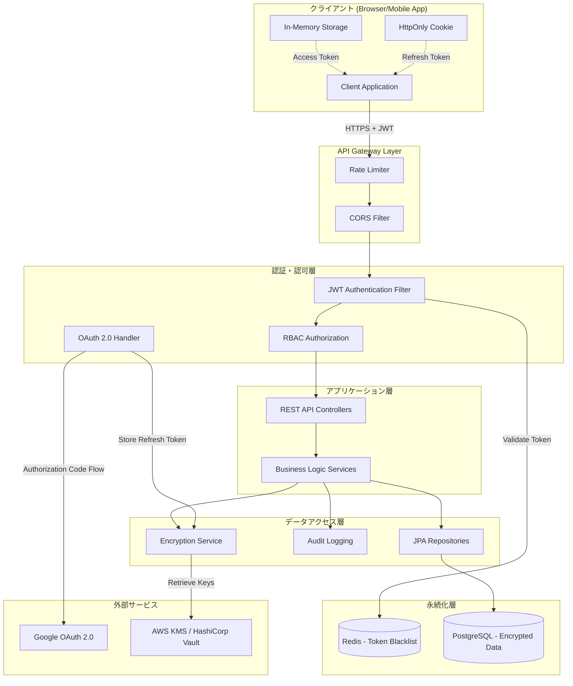
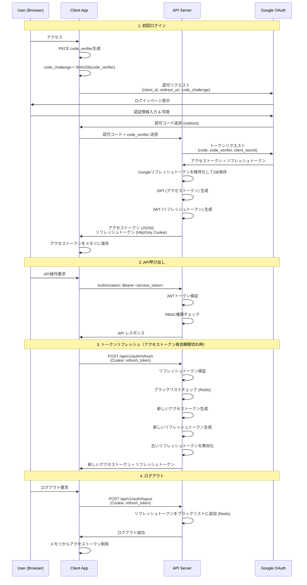

# セキュリティアーキテクチャ設計書

- バージョン: 1.0
- 作成日: 2025年12月30日
- 最終更新日: 2025年12月30日
- 作成者: Project Manager

---

## 1. 概要

本ドキュメントは、勤怠管理システムのセキュリティアーキテクチャを技術的な詳細とともに定義する。認証・認可のフロー、トークン管理、暗号化方式などを包括的に記述する。

## 2. セキュリティアーキテクチャ全体図



## 3. 認証フロー

### 3.1. OAuth 2.0 Authorization Code Flow with PKCE



### 3.2. 認証エンドポイント

#### `POST /api/v1/auth/login`
OAuth 2.0認可フローを開始する。

**レスポンス**:
```json
{
  "authorizationUrl": "https://accounts.google.com/o/oauth2/v2/auth?client_id=...&redirect_uri=...&code_challenge=..."
}
```

#### `POST /api/v1/auth/callback`
Google OAuthコールバックを処理し、JWTトークンを発行する。

**リクエスト**:
```json
{
  "code": "4/0AX4XfWh...",
  "codeVerifier": "abc123..."
}
```

**レスポンス**:
```json
{
  "accessToken": "eyJhbGciOiJSUzI1NiIsInR5cCI6IkpXVCJ9...",
  "tokenType": "Bearer",
  "expiresIn": 900
}
```

**Set-Cookie**:
```
refresh_token=eyJhbGciOiJSUzI1NiIsInR5cCI6IkpXVCJ9...; HttpOnly; Secure; SameSite=Strict; Max-Age=604800; Path=/
```

#### `POST /api/v1/auth/refresh`
リフレッシュトークンを使用して新しいアクセストークンを取得する。

**リクエスト**:
- Cookie: `refresh_token`

**レスポンス**:
```json
{
  "accessToken": "eyJhbGciOiJSUzI1NiIsInR5cCI6IkpXVCJ9...",
  "tokenType": "Bearer",
  "expiresIn": 900
}
```

#### `POST /api/v1/auth/logout`
リフレッシュトークンを無効化し、ログアウトする。

**リクエスト**:
- Cookie: `refresh_token`

**レスポンス**:
```json
{
  "message": "Logged out successfully"
}
```

## 4. JWT（JSON Web Token）設計

### 4.1. アクセストークン

#### トークン構造
```json
{
  "alg": "RS256",
  "typ": "JWT"
}
.
{
  "iss": "https://api.attendance-system.example.com",
  "sub": "user@example.com",
  "aud": "attendance-client",
  "exp": 1735564800,
  "iat": 1735563900,
  "jti": "abc123-def456-ghi789",
  "role": "USER",
  "employeeId": 42,
  "name": "Taro Yamada"
}
.
[署名]
```

#### クレーム説明

| クレーム | 説明 | 例 |
|---------|------|-----|
| `iss` | 発行者（Issuer） | `https://api.attendance-system.example.com` |
| `sub` | サブジェクト（ユーザーID） | `user@example.com` |
| `aud` | オーディエンス（対象クライアント） | `attendance-client` |
| `exp` | 有効期限（Unix timestamp） | `1735564800` |
| `iat` | 発行日時（Unix timestamp） | `1735563900` |
| `jti` | JWT ID（一意識別子） | `abc123-def456-ghi789` |
| `role` | ユーザーロール | `USER` or `ADMIN` |
| `employeeId` | 従業員ID | `42` |
| `name` | 従業員名（表示用） | `Taro Yamada` |

#### トークン仕様
- **署名アルゴリズム**: RS256（RSA + SHA-256）
- **有効期限**: 15分
- **保存場所**: クライアント側メモリのみ（LocalStorage/SessionStorage禁止）
- **用途**: API呼び出し時の`Authorization: Bearer <token>`ヘッダーに使用

### 4.2. リフレッシュトークン

#### トークン構造
```json
{
  "alg": "RS256",
  "typ": "JWT"
}
.
{
  "iss": "https://api.attendance-system.example.com",
  "sub": "user@example.com",
  "aud": "attendance-client",
  "exp": 1736169600,
  "iat": 1735563900,
  "jti": "xyz789-uvw456-rst123",
  "type": "refresh"
}
.
[署名]
```

#### トークン仕様
- **署名アルゴリズム**: RS256
- **有効期限**: 7日
- **保存場所**: HttpOnly Cookie（Secure, SameSite=Strict）
- **用途**: アクセストークンの再発行
- **ローテーション**: リフレッシュ実行時に新しいリフレッシュトークンを発行

### 4.3. JWT鍵管理

#### RSA鍵ペア生成
```bash
# 秘密鍵生成（2048ビット）
openssl genrsa -out private_key.pem 2048

# 公開鍵抽出
openssl rsa -in private_key.pem -pubout -out public_key.pem

# PKCS8フォーマットに変換（Java用）
openssl pkcs8 -topk8 -inform PEM -outform DER -in private_key.pem -out private_key.der -nocrypt
```

#### 鍵の保存
- **開発環境**: `src/main/resources/keys/` に配置（Gitには含めない）
- **本番環境**: 環境変数または AWS Secrets Manager / HashiCorp Vault から取得

#### Spring Boot設定
```yaml
# application.yml
jwt:
  public-key: classpath:keys/public_key.pem
  private-key: classpath:keys/private_key.pem
  issuer: https://api.attendance-system.example.com
  audience: attendance-client
  access-token-expiration: 900  # 15分（秒単位）
  refresh-token-expiration: 604800  # 7日（秒単位）
```

#### JWT生成実装例
```java
@Service
public class JwtService {

    @Value("${jwt.private-key}")
    private Resource privateKeyResource;

    @Value("${jwt.issuer}")
    private String issuer;

    private PrivateKey privateKey;

    @PostConstruct
    public void init() throws Exception {
        byte[] keyBytes = privateKeyResource.getInputStream().readAllBytes();
        PKCS8EncodedKeySpec spec = new PKCS8EncodedKeySpec(keyBytes);
        KeyFactory kf = KeyFactory.getInstance("RSA");
        this.privateKey = kf.generatePrivate(spec);
    }

    public String generateAccessToken(Employee employee) {
        Instant now = Instant.now();
        return Jwts.builder()
            .setIssuer(issuer)
            .setSubject(employee.getEmail())
            .setAudience("attendance-client")
            .setIssuedAt(Date.from(now))
            .setExpiration(Date.from(now.plusSeconds(900)))
            .setId(UUID.randomUUID().toString())
            .claim("role", employee.getRole())
            .claim("employeeId", employee.getId())
            .claim("name", employee.getName())
            .signWith(privateKey, SignatureAlgorithm.RS256)
            .compact();
    }

    public String generateRefreshToken(Employee employee) {
        Instant now = Instant.now();
        return Jwts.builder()
            .setIssuer(issuer)
            .setSubject(employee.getEmail())
            .setAudience("attendance-client")
            .setIssuedAt(Date.from(now))
            .setExpiration(Date.from(now.plusSeconds(604800)))
            .setId(UUID.randomUUID().toString())
            .claim("type", "refresh")
            .signWith(privateKey, SignatureAlgorithm.RS256)
            .compact();
    }
}
```

## 5. トークン失効管理

### 5.1. ブラックリスト方式（Redis使用）

#### 設計方針
- ログアウト時、リフレッシュトークンをRedisのブラックリストに追加
- トークン検証時、ブラックリストに含まれているか確認
- TTL（Time To Live）を設定し、有効期限切れ後は自動削除

#### Redis データ構造
```
Key: blacklist:refresh:<jti>
Value: "revoked"
TTL: リフレッシュトークンの有効期限まで（7日）
```

#### 実装例
```java
@Service
public class TokenBlacklistService {

    @Autowired
    private RedisTemplate<String, String> redisTemplate;

    public void revokeRefreshToken(String refreshToken) {
        Claims claims = Jwts.parserBuilder()
            .setSigningKey(publicKey)
            .build()
            .parseClaimsJws(refreshToken)
            .getBody();

        String jti = claims.getId();
        long ttl = claims.getExpiration().getTime() - System.currentTimeMillis();

        redisTemplate.opsForValue().set(
            "blacklist:refresh:" + jti,
            "revoked",
            Duration.ofMillis(ttl)
        );
    }

    public boolean isTokenRevoked(String jti) {
        return redisTemplate.hasKey("blacklist:refresh:" + jti);
    }
}
```

### 5.2. トークンローテーション

#### リフレッシュトークンローテーション戦略
1. クライアントがリフレッシュトークンを使用してアクセストークンを更新
2. サーバーは新しいアクセストークン**と**新しいリフレッシュトークンを発行
3. 古いリフレッシュトークンをブラックリストに追加
4. クライアントは新しいリフレッシュトークンをCookieに保存

#### メリット
- リフレッシュトークンが漏洩しても、次回の正当な使用で無効化される
- リプレイ攻撃のリスクを軽減

## 6. 認可（Authorization）

### 6.1. RBAC（Role-Based Access Control）

#### ロール定義
```java
public enum Role {
    USER,   // 一般ユーザー
    ADMIN   // 管理者
}
```

#### Spring Security設定
```java
@Configuration
@EnableWebSecurity
@EnableMethodSecurity
public class SecurityConfig {

    @Bean
    public SecurityFilterChain filterChain(HttpSecurity http) throws Exception {
        http
            .csrf(csrf -> csrf.disable())  // RESTful APIのため無効
            .cors(cors -> cors.configurationSource(corsConfigurationSource()))
            .sessionManagement(session ->
                session.sessionCreationPolicy(SessionCreationPolicy.STATELESS)
            )
            .authorizeHttpRequests(auth -> auth
                .requestMatchers("/api/v1/auth/**").permitAll()
                .requestMatchers("/health", "/metrics").permitAll()
                .requestMatchers("/api/v1/admin/**").hasRole("ADMIN")
                .anyRequest().authenticated()
            )
            .addFilterBefore(jwtAuthenticationFilter(), UsernamePasswordAuthenticationFilter.class);

        return http.build();
    }

    @Bean
    public JwtAuthenticationFilter jwtAuthenticationFilter() {
        return new JwtAuthenticationFilter();
    }
}
```

#### メソッドレベルの認可
```java
@Service
public class PayrollService {

    // 管理者のみ実行可能
    @PreAuthorize("hasRole('ADMIN')")
    public List<PayrollDto> calculateAllPayrolls(LocalDate start, LocalDate end) {
        // ...
    }

    // 管理者、または自分自身の給与計算のみ可能
    @PreAuthorize("hasRole('ADMIN') or #employeeId == authentication.principal.employeeId")
    public PayrollDto calculatePayroll(Integer employeeId, LocalDate start, LocalDate end) {
        // ...
    }

    // 認証済みユーザー全員が実行可能
    @PreAuthorize("isAuthenticated()")
    public EmployeeDto getMyProfile() {
        // ...
    }
}
```

### 6.2. JWTAuthenticationFilter

トークンからユーザー情報を抽出し、Spring Securityの認証コンテキストに設定する。

```java
@Component
public class JwtAuthenticationFilter extends OncePerRequestFilter {

    @Autowired
    private JwtService jwtService;

    @Override
    protected void doFilterInternal(
        HttpServletRequest request,
        HttpServletResponse response,
        FilterChain filterChain
    ) throws ServletException, IOException {

        String header = request.getHeader("Authorization");
        if (header == null || !header.startsWith("Bearer ")) {
            filterChain.doFilter(request, response);
            return;
        }

        String token = header.substring(7);

        try {
            Claims claims = jwtService.validateToken(token);

            // ブラックリストチェック
            if (tokenBlacklistService.isTokenRevoked(claims.getId())) {
                response.setStatus(HttpServletResponse.SC_UNAUTHORIZED);
                return;
            }

            // 認証情報をSpring Securityコンテキストに設定
            String email = claims.getSubject();
            String role = claims.get("role", String.class);
            Integer employeeId = claims.get("employeeId", Integer.class);

            UserDetails userDetails = new User(
                email,
                "",
                Collections.singletonList(new SimpleGrantedAuthority("ROLE_" + role))
            );

            UsernamePasswordAuthenticationToken authentication =
                new UsernamePasswordAuthenticationToken(
                    userDetails,
                    null,
                    userDetails.getAuthorities()
                );
            authentication.setDetails(Map.of("employeeId", employeeId));

            SecurityContextHolder.getContext().setAuthentication(authentication);

        } catch (JwtException e) {
            response.setStatus(HttpServletResponse.SC_UNAUTHORIZED);
            return;
        }

        filterChain.doFilter(request, response);
    }
}
```

## 7. データ暗号化

### 7.1. 通信の暗号化（TLS）

#### TLS設定
```yaml
# application.yml (本番環境)
server:
  port: 8443
  ssl:
    enabled: true
    key-store: classpath:keystore.p12
    key-store-password: ${SSL_KEYSTORE_PASSWORD}
    key-store-type: PKCS12
    key-alias: attendance-api
    protocol: TLSv1.2
    enabled-protocols: TLSv1.2,TLSv1.3
    ciphers:
      - TLS_ECDHE_RSA_WITH_AES_256_GCM_SHA384
      - TLS_ECDHE_RSA_WITH_AES_128_GCM_SHA256
```

### 7.2. データベース保存時の暗号化

#### AES-256-GCM暗号化サービス
```java
@Service
public class EncryptionService {

    private static final String ALGORITHM = "AES/GCM/NoPadding";
    private static final int GCM_IV_LENGTH = 12;
    private static final int GCM_TAG_LENGTH = 16;

    @Value("${encryption.key}")
    private String base64Key;

    private SecretKey secretKey;

    @PostConstruct
    public void init() {
        byte[] decodedKey = Base64.getDecoder().decode(base64Key);
        this.secretKey = new SecretKeySpec(decodedKey, "AES");
    }

    public String encrypt(String plainText) throws Exception {
        byte[] iv = new byte[GCM_IV_LENGTH];
        SecureRandom random = new SecureRandom();
        random.nextBytes(iv);

        Cipher cipher = Cipher.getInstance(ALGORITHM);
        GCMParameterSpec parameterSpec = new GCMParameterSpec(GCM_TAG_LENGTH * 8, iv);
        cipher.init(Cipher.ENCRYPT_MODE, secretKey, parameterSpec);

        byte[] cipherText = cipher.doFinal(plainText.getBytes(StandardCharsets.UTF_8));

        // IV + 暗号文を結合
        byte[] combined = new byte[iv.length + cipherText.length];
        System.arraycopy(iv, 0, combined, 0, iv.length);
        System.arraycopy(cipherText, 0, combined, iv.length, cipherText.length);

        return Base64.getEncoder().encodeToString(combined);
    }

    public String decrypt(String encryptedText) throws Exception {
        byte[] combined = Base64.getDecoder().decode(encryptedText);

        // IVと暗号文を分離
        byte[] iv = Arrays.copyOfRange(combined, 0, GCM_IV_LENGTH);
        byte[] cipherText = Arrays.copyOfRange(combined, GCM_IV_LENGTH, combined.length);

        Cipher cipher = Cipher.getInstance(ALGORITHM);
        GCMParameterSpec parameterSpec = new GCMParameterSpec(GCM_TAG_LENGTH * 8, iv);
        cipher.init(Cipher.DECRYPT_MODE, secretKey, parameterSpec);

        byte[] plainText = cipher.doFinal(cipherText);
        return new String(plainText, StandardCharsets.UTF_8);
    }
}
```

#### 鍵管理
```bash
# 開発環境: 環境変数に設定
export ENCRYPTION_KEY=$(openssl rand -base64 32)

# application.yml
encryption:
  key: ${ENCRYPTION_KEY}
```

**本番環境**: AWS KMS または HashiCorp Vault を使用

#### JPA Converterによる自動暗号化
```java
@Converter
public class EncryptedStringConverter implements AttributeConverter<String, String> {

    @Autowired
    private EncryptionService encryptionService;

    @Override
    public String convertToDatabaseColumn(String attribute) {
        if (attribute == null) {
            return null;
        }
        try {
            return encryptionService.encrypt(attribute);
        } catch (Exception e) {
            throw new RuntimeException("Encryption failed", e);
        }
    }

    @Override
    public String convertToEntityAttribute(String dbData) {
        if (dbData == null) {
            return null;
        }
        try {
            return encryptionService.decrypt(dbData);
        } catch (Exception e) {
            throw new RuntimeException("Decryption failed", e);
        }
    }
}

// Entityクラスでの使用
@Entity
public class Employee {
    @Id
    @GeneratedValue(strategy = GenerationType.IDENTITY)
    private Integer id;

    @Convert(converter = EncryptedStringConverter.class)
    private String email;

    @Convert(converter = EncryptedStringConverter.class)
    @Column(name = "google_refresh_token_encrypted")
    private String googleRefreshToken;

    // ...
}
```

## 8. レート制限

### 8.1. Bucket4jによるレート制限

#### 依存関係
```xml
<dependency>
    <groupId>com.github.vladimir-bukhtoyarov</groupId>
    <artifactId>bucket4j-core</artifactId>
    <version>8.2.0</version>
</dependency>
```

#### レート制限実装
```java
@Component
public class RateLimitInterceptor implements HandlerInterceptor {

    private final Map<String, Bucket> buckets = new ConcurrentHashMap<>();

    @Override
    public boolean preHandle(
        HttpServletRequest request,
        HttpServletResponse response,
        Object handler
    ) throws Exception {

        String key = getClientIdentifier(request);
        Bucket bucket = buckets.computeIfAbsent(key, k -> createBucket(request));

        if (bucket.tryConsume(1)) {
            return true;
        } else {
            response.setStatus(429); // Too Many Requests
            response.setHeader("X-Rate-Limit-Retry-After-Seconds", "60");
            response.getWriter().write("{\"error\": \"Rate limit exceeded\"}");
            return false;
        }
    }

    private String getClientIdentifier(HttpServletRequest request) {
        // 認証済みユーザーの場合はユーザーID、未認証の場合はIPアドレス
        Authentication auth = SecurityContextHolder.getContext().getAuthentication();
        if (auth != null && auth.isAuthenticated()) {
            return "user:" + auth.getName();
        } else {
            return "ip:" + request.getRemoteAddr();
        }
    }

    private Bucket createBucket(HttpServletRequest request) {
        Authentication auth = SecurityContextHolder.getContext().getAuthentication();
        Bandwidth limit;

        if (auth != null && auth.isAuthenticated()) {
            // 認証済みユーザー: 100req/min
            limit = Bandwidth.classic(100, Refill.intervally(100, Duration.ofMinutes(1)));
        } else {
            // 未認証: 10req/min
            limit = Bandwidth.classic(10, Refill.intervally(10, Duration.ofMinutes(1)));
        }

        return Bucket.builder().addLimit(limit).build();
    }
}
```

## 9. CORS設定

```java
@Configuration
public class SecurityConfig {

    @Bean
    public CorsConfigurationSource corsConfigurationSource() {
        CorsConfiguration config = new CorsConfiguration();

        // 許可するオリジン
        config.setAllowedOrigins(Arrays.asList(
            "https://app.example.com",
            "http://localhost:3000"  // 開発環境のみ
        ));

        // 許可するHTTPメソッド
        config.setAllowedMethods(Arrays.asList(
            "GET", "POST", "PUT", "DELETE", "OPTIONS"
        ));

        // 許可するヘッダー
        config.setAllowedHeaders(Arrays.asList(
            "Authorization",
            "Content-Type",
            "X-Requested-With"
        ));

        // Cookie送信を許可
        config.setAllowCredentials(true);

        // プリフライトリクエストのキャッシュ時間（秒）
        config.setMaxAge(3600L);

        UrlBasedCorsConfigurationSource source = new UrlBasedCorsConfigurationSource();
        source.registerCorsConfiguration("/api/**", config);
        return source;
    }
}
```

## 10. 監査ログ

### 10.1. Spring Data JPA Auditingの設定

```java
@Configuration
@EnableJpaAuditing
public class JpaAuditingConfig {

    @Bean
    public AuditorAware<Integer> auditorProvider() {
        return () -> {
            Authentication auth = SecurityContextHolder.getContext().getAuthentication();
            if (auth != null && auth.isAuthenticated()) {
                Map<String, Object> details = (Map<String, Object>) auth.getDetails();
                return Optional.ofNullable((Integer) details.get("employeeId"));
            }
            return Optional.empty();
        };
    }
}

// Entityクラス
@Entity
@EntityListeners(AuditingEntityListener.class)
public class Employee {
    // ...

    @CreatedDate
    @Column(nullable = false, updatable = false)
    private Instant createdAt;

    @LastModifiedDate
    @Column(nullable = false)
    private Instant updatedAt;

    @CreatedBy
    @Column(updatable = false)
    private Integer createdBy;

    @LastModifiedBy
    private Integer updatedBy;
}
```

## 11. まとめ

本セキュリティアーキテクチャは以下の要素で構成される:

1. ✅ **認証**: OAuth 2.0 with PKCE + JWT (RS256)
2. ✅ **認可**: RBAC（Spring Security + @PreAuthorize）
3. ✅ **トークン管理**: リフレッシュトークンローテーション、Redisブラックリスト
4. ✅ **暗号化**: TLS 1.2+、AES-256-GCM（データ保存時）
5. ✅ **レート制限**: Bucket4j（認証済み100req/min、未認証10req/min）
6. ✅ **CORS**: 許可されたオリジンのみアクセス可能
7. ✅ **監査**: Spring Data JPA Auditingによる自動記録

すべてのコンポーネントは密接に連携し、多層防御（Defense in Depth）を実現する。
