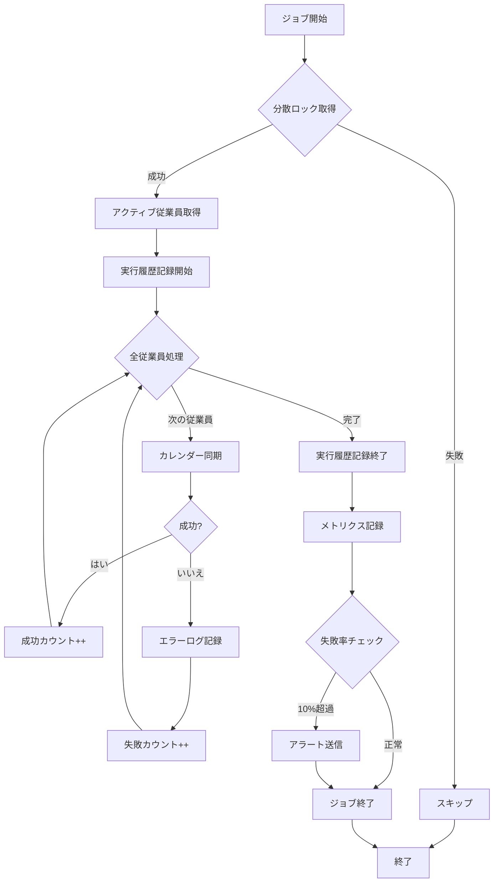

# バッチジョブ設計書

- バージョン: 1.0
- 作成日: 2025年12月30日
- 最終更新日: 2025年12月30日
- 作成者: Project Manager

---

## 1. 概要

本ドキュメントは、勤怠管理システムのバッチジョブの詳細設計を定義する。定期実行ジョブのスケジュール、処理フロー、エラーハンドリング、監視方法を包括的に記述する。

## 2. バッチジョブ一覧

| ジョブ名 | 説明 | 実行頻度 | 実行時間 | 優先度 |
|---------|------|---------|---------|--------|
| CalendarSyncJob | Googleカレンダーから勤務記録を同期 | 毎時 | 最大50分 | High |
| SheetSyncJob | Googleスプレッドシートから生徒情報を同期 | 毎日 | 最大10分 | Medium |
| PayrollArchiveJob | 古い給与計算履歴をアーカイブ | 毎月1日 | 最大30分 | Low |
| AuditLogCleanupJob | 古い監査ログを削除 | 毎週日曜 | 最大20分 | Low |

---

## 3. CalendarSyncJob（カレンダー同期）

### 3.1. 目的

アクティブな全従業員のGoogleカレンダーから勤務記録を取得し、データベースに保存する。

### 3.2. スケジュール

```java
@Scheduled(cron = "0 0 * * * *")  // 毎時0分に実行
```

- **実行頻度**: 毎時
- **実行時刻**: 毎時0分（例: 10:00, 11:00, 12:00）
- **タイムゾーン**: Asia/Tokyo

### 3.3. 処理フロー



### 3.4. 詳細実装

```java
@Component
@Slf4j
public class CalendarSyncJob {

    @Autowired
    private EmployeeRepository employeeRepository;

    @Autowired
    private GoogleCalendarService googleCalendarService;

    @Autowired
    private WorkRecordRepository workRecordRepository;

    @Autowired
    private BatchJobHistoryRepository batchJobHistoryRepository;

    @Autowired
    private MeterRegistry meterRegistry;

    @Scheduled(cron = "0 0 * * * *", zone = "Asia/Tokyo")
    @SchedulerLock(
        name = "CalendarSyncJob",
        lockAtMostFor = "50m",  // 最大50分でロック解放
        lockAtLeastFor = "5m"   // 最低5分はロック保持
    )
    public void execute() {
        String jobId = UUID.randomUUID().toString();
        Instant startTime = Instant.now();

        log.info("Calendar sync job started", kv("jobId", jobId));

        // 実行履歴の記録開始
        BatchJobHistory history = BatchJobHistory.builder()
            .jobName("CalendarSyncJob")
            .startedAt(startTime)
            .status("RUNNING")
            .build();
        history = batchJobHistoryRepository.save(history);

        int successCount = 0;
        int failureCount = 0;
        List<SyncError> errors = new ArrayList<>();

        try {
            List<Employee> activeEmployees = employeeRepository.findByIsActiveTrue();

            log.info("Processing employees",
                kv("jobId", jobId),
                kv("totalEmployees", activeEmployees.size())
            );

            for (Employee employee : activeEmployees) {
                try {
                    syncEmployeeCalendar(employee);
                    successCount++;

                } catch (Exception ex) {
                    failureCount++;
                    errors.add(new SyncError(employee.getId(), ex.getMessage()));

                    log.error("Failed to sync calendar for employee",
                        kv("jobId", jobId),
                        kv("employeeId", employee.getId()),
                        kv("employeeName", maskName(employee.getName())),
                        kv("errorMessage", ex.getMessage()),
                        ex
                    );
                }
            }

        } finally {
            Duration duration = Duration.between(startTime, Instant.now());

            // 実行履歴の更新
            history.setEndedAt(Instant.now());
            history.setStatus("SUCCESS");
            history.setSuccessCount(successCount);
            history.setFailureCount(failureCount);
            if (!errors.isEmpty()) {
                history.setErrorDetails(convertToJson(errors));
            }
            batchJobHistoryRepository.save(history);

            // メトリクス記録
            meterRegistry.counter("calendar_sync.success", "job", "CalendarSyncJob")
                .increment(successCount);
            meterRegistry.counter("calendar_sync.failure", "job", "CalendarSyncJob")
                .increment(failureCount);
            meterRegistry.timer("calendar_sync.duration", "job", "CalendarSyncJob")
                .record(duration);

            log.info("Calendar sync job completed",
                kv("jobId", jobId),
                kv("successCount", successCount),
                kv("failureCount", failureCount),
                kv("durationMs", duration.toMillis())
            );

            // 失敗率が10%を超えた場合はアラート
            int totalEmployees = successCount + failureCount;
            if (totalEmployees > 0 && (double) failureCount / totalEmployees > 0.1) {
                alertService.sendAlert(
                    "CalendarSyncJob",
                    "High failure rate detected: " + failureCount + "/" + totalEmployees
                );
            }
        }
    }

    private void syncEmployeeCalendar(Employee employee) {
        // 最後の同期時刻以降のイベントのみ取得
        Instant lastSync = employee.getLastSyncedAt() != null
            ? employee.getLastSyncedAt()
            : Instant.now().minus(30, ChronoUnit.DAYS);

        Instant now = Instant.now();

        log.debug("Syncing calendar for employee",
            kv("employeeId", employee.getId()),
            kv("lastSync", lastSync),
            kv("now", now)
        );

        // Google Calendar APIからイベント取得
        List<Event> events = googleCalendarService.getEvents(employee, lastSync, now);

        int newRecords = 0;
        int duplicates = 0;
        int skipped = 0;

        for (Event event : events) {
            // イベントタイトルから勤務形態を判定
            Optional<WorkType> workType = matchWorkType(event.getSummary());

            if (workType.isEmpty()) {
                skipped++;
                log.debug("No matching work type for event",
                    kv("eventTitle", event.getSummary())
                );
                continue;
            }

            if (!workType.get().getIsPayrollTarget()) {
                skipped++;
                log.debug("Event is not payroll target",
                    kv("eventTitle", event.getSummary()),
                    kv("workType", workType.get().getName())
                );
                continue;
            }

            // 重複チェック
            if (workRecordRepository.existsByGoogleEventId(event.getId())) {
                duplicates++;
                log.debug("Duplicate event skipped",
                    kv("eventId", event.getId())
                );
                continue;
            }

            // 生徒名抽出
            String studentName = extractStudentName(
                event.getSummary(),
                workType.get().getCalendarKeyword()
            );

            // WorkRecord作成
            WorkRecord record = WorkRecord.builder()
                .employeeId(employee.getId())
                .googleEventId(event.getId())
                .eventTitle(event.getSummary())
                .startTime(convertToInstant(event.getStart().getDateTime()))
                .endTime(convertToInstant(event.getEnd().getDateTime()))
                .workTypeId(workType.get().getId())
                .extractedStudentName(studentName)
                .syncedAt(now)
                .build();

            // Student IDの解決（可能であれば）
            if (studentName != null) {
                studentRepository.findByName(studentName)
                    .ifPresent(student -> record.setStudentId(student.getId()));
            }

            workRecordRepository.save(record);
            newRecords++;

            log.debug("Work record created",
                kv("eventId", event.getId()),
                kv("workTypeId", workType.get().getId()),
                kv("studentName", studentName)
            );
        }

        // 同期時刻を更新
        employee.setLastSyncedAt(now);
        employeeRepository.save(employee);

        log.info("Synced calendar for employee",
            kv("employeeId", employee.getId()),
            kv("totalEvents", events.size()),
            kv("newRecords", newRecords),
            kv("duplicates", duplicates),
            kv("skipped", skipped)
        );
    }

    private Optional<WorkType> matchWorkType(String eventTitle) {
        List<WorkType> workTypes = workTypeRepository.findAll();

        return workTypes.stream()
            .filter(wt -> eventTitle.startsWith(wt.getCalendarKeyword()))
            .findFirst();
    }

    private String extractStudentName(String eventTitle, String keyword) {
        // "個別（山田太郎）" → "山田太郎"
        String pattern = keyword + "\\s*[（(](.+?)[)）]";
        Pattern regex = Pattern.compile(pattern);
        Matcher matcher = regex.matcher(eventTitle);

        if (matcher.find()) {
            return matcher.group(1).trim();
        }

        return null;
    }

    @Data
    @AllArgsConstructor
    private static class SyncError {
        private Integer employeeId;
        private String errorMessage;
    }
}
```

### 3.5. エラーハンドリング

1. **Google API障害**:
   - リトライ: 最大3回、指数バックオフ
   - 失敗時: エラーログ記録、アラート送信、DLQに保存

2. **データベース接続エラー**:
   - トランザクションロールバック
   - ジョブ全体を失敗として記録

3. **部分的な失敗**:
   - 1従業員の失敗は他の従業員の処理を妨げない
   - 失敗率が10%を超えたらアラート送信

### 3.6. 監視・アラート

**Prometheusメトリクス**:
- `calendar_sync_success_total`: 成功件数
- `calendar_sync_failure_total`: 失敗件数
- `calendar_sync_duration_seconds`: 実行時間

**アラート条件**:
- 失敗率 > 10%
- 実行時間 > 50分
- 連続3回失敗

---

## 4. SheetSyncJob（生徒情報同期）

### 4.1. 目的

Googleスプレッドシートから生徒情報を取得し、データベースを更新する。

### 4.2. スケジュール

```java
@Scheduled(cron = "0 0 2 * * *", zone = "Asia/Tokyo")  // 毎日2:00に実行
```

### 4.3. 処理フロー

1. Googleスプレッドシートからデータ取得
2. `student_levels`テーブルと照合
3. 新規生徒を`students`テーブルに追加
4. 既存生徒の情報を更新
5. スプレッドシートに存在しない生徒を`is_active=false`に更新

### 4.4. 詳細実装

```java
@Component
@Slf4j
public class SheetSyncJob {

    @Scheduled(cron = "0 0 2 * * *", zone = "Asia/Tokyo")
    @SchedulerLock(name = "SheetSyncJob", lockAtMostFor = "10m")
    public void execute() {
        String jobId = UUID.randomUUID().toString();
        Instant startTime = Instant.now();

        log.info("Sheet sync job started", kv("jobId", jobId));

        BatchJobHistory history = BatchJobHistory.builder()
            .jobName("SheetSyncJob")
            .startedAt(startTime)
            .status("RUNNING")
            .build();
        history = batchJobHistoryRepository.save(history);

        int addedCount = 0;
        int updatedCount = 0;
        int deactivatedCount = 0;

        try {
            // Googleスプレッドシートからデータ取得
            List<StudentData> sheetData = googleSheetsService.getStudentData();

            // スプレッドシートの生徒名セット
            Set<String> sheetStudentNames = sheetData.stream()
                .map(StudentData::getName)
                .collect(Collectors.toSet());

            // 既存の生徒を取得
            List<Student> existingStudents = studentRepository.findAll();
            Map<String, Student> studentMap = existingStudents.stream()
                .collect(Collectors.toMap(Student::getName, s -> s));

            // 新規追加・更新
            for (StudentData data : sheetData) {
                Student existing = studentMap.get(data.getName());

                if (existing == null) {
                    // 新規追加
                    StudentLevel level = studentLevelRepository
                        .findByLevelName(data.getLevelName())
                        .orElseThrow(() -> new IllegalArgumentException(
                            "Invalid student level: " + data.getLevelName()
                        ));

                    Student student = Student.builder()
                        .name(data.getName())
                        .studentLevelId(level.getId())
                        .isActive(true)
                        .build();

                    studentRepository.save(student);
                    addedCount++;

                    log.info("New student added",
                        kv("studentName", data.getName()),
                        kv("studentLevel", data.getLevelName())
                    );

                } else if (!existing.getStudentLevelId().equals(
                           studentLevelRepository.findByLevelName(data.getLevelName())
                               .orElseThrow().getId())) {
                    // レベル変更
                    StudentLevel newLevel = studentLevelRepository
                        .findByLevelName(data.getLevelName())
                        .orElseThrow();

                    existing.setStudentLevelId(newLevel.getId());
                    existing.setIsActive(true);
                    studentRepository.save(existing);
                    updatedCount++;

                    log.info("Student level updated",
                        kv("studentName", data.getName()),
                        kv("newLevel", data.getLevelName())
                    );
                }
            }

            // スプレッドシートに存在しない生徒を無効化
            for (Student student : existingStudents) {
                if (!sheetStudentNames.contains(student.getName()) && student.getIsActive()) {
                    student.setIsActive(false);
                    studentRepository.save(student);
                    deactivatedCount++;

                    log.info("Student deactivated",
                        kv("studentName", student.getName())
                    );
                }
            }

            history.setStatus("SUCCESS");
            history.setSuccessCount(addedCount + updatedCount);

        } catch (Exception ex) {
            log.error("Sheet sync job failed", kv("jobId", jobId), ex);
            history.setStatus("FAILURE");
            history.setErrorDetails(convertToJson(ex.getMessage()));

        } finally {
            Duration duration = Duration.between(startTime, Instant.now());
            history.setEndedAt(Instant.now());
            batchJobHistoryRepository.save(history);

            log.info("Sheet sync job completed",
                kv("jobId", jobId),
                kv("addedCount", addedCount),
                kv("updatedCount", updatedCount),
                kv("deactivatedCount", deactivatedCount),
                kv("durationMs", duration.toMillis())
            );
        }
    }

    @Data
    private static class StudentData {
        private String name;
        private String levelName;
    }
}
```

---

## 5. PayrollArchiveJob（給与履歴アーカイブ）

### 5.1. 目的

1年以上前の給与計算履歴を別テーブルまたはS3にアーカイブする。

### 5.2. スケジュール

```java
@Scheduled(cron = "0 0 3 1 * *", zone = "Asia/Tokyo")  // 毎月1日3:00に実行
```

### 5.3. 処理概要

1. 1年以上前の`payroll_histories`を取得
2. S3にJSON形式でアーカイブ
3. 元のレコードを削除

---

## 6. AuditLogCleanupJob（監査ログクリーンアップ）

### 6.1. 目的

5年以上前の監査ログを削除する。

### 6.2. スケジュール

```java
@Scheduled(cron = "0 0 4 * * SUN", zone = "Asia/Tokyo")  // 毎週日曜4:00に実行
```

### 6.3. 処理概要

```java
@Transactional
public void execute() {
    Instant cutoffDate = Instant.now().minus(1825, ChronoUnit.DAYS);  // 5年前
    int deletedCount = auditLogRepository.deleteByChangedAtBefore(cutoffDate);

    log.info("Audit log cleanup completed", kv("deletedCount", deletedCount));
}
```

---

## 7. 分散ロック（ShedLock）

複数インスタンスで同じジョブが同時実行されないように、ShedLockを使用する。

### 7.1. 設定

```xml
<!-- pom.xml -->
<dependency>
    <groupId>net.javacrumbs.shedlock</groupId>
    <artifactId>shedlock-spring</artifactId>
    <version>5.10.0</version>
</dependency>
<dependency>
    <groupId>net.javacrumbs.shedlock</groupId>
    <artifactId>shedlock-provider-jdbc-template</artifactId>
    <version>5.10.0</version>
</dependency>
```

```java
@Configuration
@EnableScheduling
@EnableSchedulerLock(defaultLockAtMostFor = "10m")
public class SchedulerConfig {

    @Bean
    public LockProvider lockProvider(DataSource dataSource) {
        return new JdbcTemplateLockProvider(
            JdbcTemplateLockProvider.Configuration.builder()
                .withJdbcTemplate(new JdbcTemplate(dataSource))
                .usingDbTime()
                .build()
        );
    }
}
```

### 7.2. ロックテーブル

```sql
CREATE TABLE shedlock (
    name VARCHAR(64) NOT NULL,
    lock_until TIMESTAMP NOT NULL,
    locked_at TIMESTAMP NOT NULL,
    locked_by VARCHAR(255) NOT NULL,
    PRIMARY KEY (name)
);
```

---

## 8. まとめ

本バッチジョブ設計は以下を実現する:

1. ✅ **スケジュール管理**: Cron式で柔軟な実行スケジュール
2. ✅ **分散ロック**: ShedLockで重複実行を防止
3. ✅ **エラーハンドリング**: リトライ、フォールバック、アラート
4. ✅ **監視**: Prometheusメトリクス、実行履歴
5. ✅ **ログ**: 構造化ログで追跡可能

すべてのバッチジョブは堅牢で、本番運用に耐える設計となっている。
