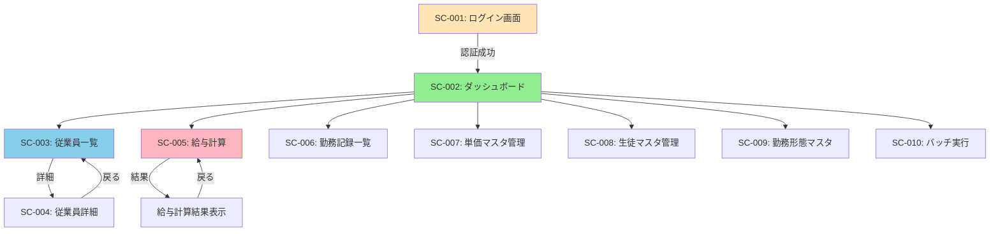

# 画面設計書

- バージョン: 1.0
- 作成日: 2025年12月30日
- 最終更新日: 2025年12月30日
- 作成者: Project Manager

---

## 1. 概要

本ドキュメントは、勤怠管理システムの管理画面（Thymeleaf）の画面設計を定義する。管理者と一般ユーザーがWebブラウザからアクセスし、従業員管理、給与計算、勤務記録閲覧を行う画面のレイアウト、遷移、機能を記載する。

---

## 2. 画面一覧

| 画面ID | 画面名 | URL | アクセス権限 | 主な機能 |
|--------|--------|-----|-----------|---------|
| **SC-001** | ログイン画面 | `/login` | 全員 | Google OAuth認証 |
| **SC-002** | ダッシュボード | `/dashboard` | USER, ADMIN | 概要表示、メニュー |
| **SC-003** | 従業員一覧 | `/employees` | ADMIN | 従業員CRUD |
| **SC-004** | 従業員詳細 | `/employees/{id}` | ADMIN | 詳細表示・編集 |
| **SC-005** | 給与計算 | `/payroll` | ADMIN, USER | 給与計算実行・結果表示 |
| **SC-006** | 勤務記録一覧 | `/work-records` | ADMIN, USER | 勤務記録閲覧 |
| **SC-007** | 単価マスタ管理 | `/hourly-wages` | ADMIN | 単価CRUD |
| **SC-008** | 生徒マスタ管理 | `/students` | ADMIN | 生徒CRUD |
| **SC-009** | 勤務形態マスタ | `/work-types` | ADMIN | 勤務形態CRUD |
| **SC-010** | バッチ実行 | `/admin/batch` | ADMIN | 手動バッチ実行 |

---

## 3. 画面遷移図



---

## 4. 画面詳細設計

### SC-001: ログイン画面

**URL**: `/login`

**アクセス権限**: 全員（未認証）

**目的**: Google OAuthでログイン

**ワイヤーフレーム**:

```
┌────────────────────────────────────────┐
│                                        │
│         勤怠管理システム                 │
│     Attendance Management System       │
│                                        │
│  ┌──────────────────────────────────┐  │
│  │                                  │  │
│  │   🔐 Googleでログイン             │  │
│  │                                  │  │
│  └──────────────────────────────────┘  │
│                                        │
│                                        │
└────────────────────────────────────────┘
```

**HTML要素**:

```html
<!DOCTYPE html>
<html xmlns:th="http://www.thymeleaf.org">
<head>
    <title>ログイン - 勤怠管理システム</title>
    <link rel="stylesheet" th:href="@{/css/bootstrap.min.css}">
</head>
<body class="bg-light">
    <div class="container">
        <div class="row justify-content-center mt-5">
            <div class="col-md-6">
                <div class="card">
                    <div class="card-body text-center">
                        <h1 class="card-title mb-4">勤怠管理システム</h1>
                        <p class="text-muted">Attendance Management System</p>
                        <a th:href="@{/oauth2/authorization/google}"
                           class="btn btn-primary btn-lg">
                            🔐 Googleでログイン
                        </a>
                    </div>
                </div>
            </div>
        </div>
    </div>
</body>
</html>
```

**機能**:
1. 「Googleでログイン」ボタンクリック → `/oauth2/authorization/google` へリダイレクト
2. OAuth認証成功 → `/dashboard` へ遷移
3. 認証失敗 → エラーメッセージ表示

---

### SC-002: ダッシュボード

**URL**: `/dashboard`

**アクセス権限**: USER, ADMIN

**目的**: システムの概要表示、各機能へのメニュー

**ワイヤーフレーム**:

```
┌────────────────────────────────────────────────────────────┐
│ 勤怠管理システム              ログアウト | 山田太郎(ADMIN)  │
├────────────────────────────────────────────────────────────┤
│                                                            │
│  📊 ダッシュボード                                          │
│                                                            │
│  ┌─────────────────┐  ┌─────────────────┐  ┌────────────┐ │
│  │ 今月の勤務時間   │  │ 未払い給与       │  │ 従業員数   │ │
│  │ 120時間          │  │ ¥216,000        │  │ 5名        │ │
│  └─────────────────┘  └─────────────────┘  └────────────┘ │
│                                                            │
│  メニュー:                                                  │
│  ┌──────────────────────────────────────────────────────┐  │
│  │ 👤 従業員管理      │ 💰 給与計算      │ 📋 勤務記録    │  │
│  ├──────────────────────────────────────────────────────┤  │
│  │ 💵 単価マスタ      │ 👨‍🎓 生徒マスタ  │ 📁 勤務形態    │  │
│  ├──────────────────────────────────────────────────────┤  │
│  │ ⚙️ バッチ実行 (ADMIN only)                             │  │
│  └──────────────────────────────────────────────────────┘  │
│                                                            │
└────────────────────────────────────────────────────────────┘
```

**HTML要素**:

```html
<!DOCTYPE html>
<html xmlns:th="http://www.thymeleaf.org">
<head>
    <title>ダッシュボード - 勤怠管理システム</title>
    <link rel="stylesheet" th:href="@{/css/bootstrap.min.css}">
</head>
<body>
    <!-- ヘッダー -->
    <nav class="navbar navbar-expand-lg navbar-dark bg-primary">
        <div class="container-fluid">
            <a class="navbar-brand" href="#">勤怠管理システム</a>
            <div class="navbar-text text-white">
                <span th:text="${userName}">山田太郎</span>
                (<span th:text="${userRole}">ADMIN</span>)
                <a th:href="@{/logout}" class="btn btn-outline-light ms-3">ログアウト</a>
            </div>
        </div>
    </nav>

    <div class="container mt-4">
        <h2>📊 ダッシュボード</h2>

        <!-- サマリーカード -->
        <div class="row mt-4">
            <div class="col-md-4">
                <div class="card text-center">
                    <div class="card-body">
                        <h5 class="card-title">今月の勤務時間</h5>
                        <p class="display-4" th:text="${totalWorkHours} + '時間'">120時間</p>
                    </div>
                </div>
            </div>
            <div class="col-md-4">
                <div class="card text-center">
                    <div class="card-body">
                        <h5 class="card-title">未払い給与</h5>
                        <p class="display-4" th:text="'¥' + ${unpaidSalary}">¥216,000</p>
                    </div>
                </div>
            </div>
            <div class="col-md-4">
                <div class="card text-center">
                    <div class="card-body">
                        <h5 class="card-title">従業員数</h5>
                        <p class="display-4" th:text="${employeeCount} + '名'">5名</p>
                    </div>
                </div>
            </div>
        </div>

        <!-- メニューグリッド -->
        <div class="row mt-5">
            <div class="col-md-4 mb-3">
                <a th:href="@{/employees}" class="btn btn-lg btn-outline-primary w-100">
                    👤 従業員管理
                </a>
            </div>
            <div class="col-md-4 mb-3">
                <a th:href="@{/payroll}" class="btn btn-lg btn-outline-success w-100">
                    💰 給与計算
                </a>
            </div>
            <div class="col-md-4 mb-3">
                <a th:href="@{/work-records}" class="btn btn-lg btn-outline-info w-100">
                    📋 勤務記録
                </a>
            </div>
            <div class="col-md-4 mb-3" th:if="${userRole == 'ADMIN'}">
                <a th:href="@{/hourly-wages}" class="btn btn-lg btn-outline-warning w-100">
                    💵 単価マスタ
                </a>
            </div>
            <div class="col-md-4 mb-3" th:if="${userRole == 'ADMIN'}">
                <a th:href="@{/students}" class="btn btn-lg btn-outline-secondary w-100">
                    👨‍🎓 生徒マスタ
                </a>
            </div>
            <div class="col-md-4 mb-3" th:if="${userRole == 'ADMIN'}">
                <a th:href="@{/work-types}" class="btn btn-lg btn-outline-dark w-100">
                    📁 勤務形態
                </a>
            </div>
            <div class="col-md-4 mb-3" th:if="${userRole == 'ADMIN'}">
                <a th:href="@{/admin/batch}" class="btn btn-lg btn-outline-danger w-100">
                    ⚙️ バッチ実行
                </a>
            </div>
        </div>
    </div>
</body>
</html>
```

---

### SC-003: 従業員一覧

**URL**: `/employees`

**アクセス権限**: ADMIN

**目的**: 従業員の一覧表示、新規登録、編集、削除

**ワイヤーフレーム**:

```
┌────────────────────────────────────────────────────────────┐
│ 勤怠管理システム              ログアウト | 山田太郎(ADMIN)  │
├────────────────────────────────────────────────────────────┤
│                                                            │
│  👤 従業員一覧                            [+ 新規登録]      │
│                                                            │
│  検索: [__________________] [🔍検索]                       │
│                                                            │
│  ┌──────┬───────────┬────────────────┬────────┬──────┐   │
│  │ ID   │ 名前      │ メール          │ 役割   │ 操作 │   │
│  ├──────┼───────────┼────────────────┼────────┼──────┤   │
│  │ 1    │ 山田太郎  │ yamada@ex.com  │ ADMIN  │ 編集 │   │
│  │ 2    │ 佐藤花子  │ sato@ex.com    │ USER   │ 編集 │   │
│  │ 3    │ 鈴木一郎  │ suzuki@ex.com  │ USER   │ 編集 │   │
│  └──────┴───────────┴────────────────┴────────┴──────┘   │
│                                                            │
│  << 前へ  1 2 3  次へ >>                                    │
│                                                            │
└────────────────────────────────────────────────────────────┘
```

**HTML要素**:

```html
<!DOCTYPE html>
<html xmlns:th="http://www.thymeleaf.org">
<head>
    <title>従業員一覧 - 勤怠管理システム</title>
    <link rel="stylesheet" th:href="@{/css/bootstrap.min.css}">
</head>
<body>
    <!-- ヘッダー（省略: SC-002と同様） -->

    <div class="container mt-4">
        <div class="d-flex justify-content-between align-items-center">
            <h2>👤 従業員一覧</h2>
            <a th:href="@{/employees/new}" class="btn btn-primary">+ 新規登録</a>
        </div>

        <!-- 検索フォーム -->
        <form th:action="@{/employees}" method="get" class="mt-3">
            <div class="input-group">
                <input type="text" name="search" class="form-control"
                       placeholder="名前またはメールで検索"
                       th:value="${param.search}">
                <button type="submit" class="btn btn-outline-secondary">🔍 検索</button>
            </div>
        </form>

        <!-- 従業員テーブル -->
        <table class="table table-striped mt-4">
            <thead>
                <tr>
                    <th>ID</th>
                    <th>名前</th>
                    <th>メール</th>
                    <th>役割</th>
                    <th>状態</th>
                    <th>操作</th>
                </tr>
            </thead>
            <tbody>
                <tr th:each="employee : ${employees}">
                    <td th:text="${employee.id}">1</td>
                    <td th:text="${employee.name}">山田太郎</td>
                    <td th:text="${employee.email}">yamada@example.com</td>
                    <td>
                        <span th:if="${employee.role == 'ADMIN'}" class="badge bg-danger">ADMIN</span>
                        <span th:if="${employee.role == 'USER'}" class="badge bg-primary">USER</span>
                    </td>
                    <td>
                        <span th:if="${employee.isActive}" class="badge bg-success">有効</span>
                        <span th:unless="${employee.isActive}" class="badge bg-secondary">無効</span>
                    </td>
                    <td>
                        <a th:href="@{/employees/{id}(id=${employee.id})}"
                           class="btn btn-sm btn-outline-primary">編集</a>
                        <a th:href="@{/employees/{id}/delete(id=${employee.id})}"
                           class="btn btn-sm btn-outline-danger"
                           onclick="return confirm('本当に削除しますか？')">削除</a>
                    </td>
                </tr>
            </tbody>
        </table>

        <!-- ページネーション -->
        <nav th:if="${totalPages > 1}">
            <ul class="pagination">
                <li class="page-item" th:classappend="${currentPage == 0} ? 'disabled'">
                    <a class="page-link" th:href="@{/employees(page=${currentPage - 1})}">前へ</a>
                </li>
                <li class="page-item" th:each="i : ${#numbers.sequence(0, totalPages - 1)}"
                    th:classappend="${i == currentPage} ? 'active'">
                    <a class="page-link" th:href="@{/employees(page=${i})}" th:text="${i + 1}">1</a>
                </li>
                <li class="page-item" th:classappend="${currentPage == totalPages - 1} ? 'disabled'">
                    <a class="page-link" th:href="@{/employees(page=${currentPage + 1})}">次へ</a>
                </li>
            </ul>
        </nav>
    </div>
</body>
</html>
```

---

### SC-005: 給与計算

**URL**: `/payroll`

**アクセス権限**: ADMIN, USER（自分の給与のみ）

**目的**: 給与計算を実行し、結果を表示

**ワイヤーフレーム**:

```
┌────────────────────────────────────────────────────────────┐
│ 勤怠管理システム              ログアウト | 山田太郎(ADMIN)  │
├────────────────────────────────────────────────────────────┤
│                                                            │
│  💰 給与計算                                               │
│                                                            │
│  従業員: [山田太郎 ▼]                                       │
│  期間:   [2025-11-01] 〜 [2025-11-30]                      │
│                                                            │
│  [計算実行]                                                 │
│                                                            │
│  ┌──────────────────────────────────────────────────────┐  │
│  │ 計算結果                                              │  │
│  ├──────────────────────────────────────────────────────┤  │
│  │ 従業員: 山田太郎                                       │  │
│  │ 期間: 2025-11-01 〜 2025-11-30                        │  │
│  │                                                       │  │
│  │ 総勤務時間: 90時間（5,400分）                          │  │
│  │ 総支払額: ¥216,000                                    │  │
│  │                                                       │  │
│  │ ┌───────────┬────────┬──────┬──────┬─────────┐    │  │
│  │ │ 勤務形態  │生徒レベル│時間  │単価  │小計     │    │  │
│  │ ├───────────┼────────┼──────┼──────┼─────────┤    │  │
│  │ │ 個別指導  │ 中学生   │ 60h  │¥3000 │¥180,000 │    │  │
│  │ │ 自習室    │ -        │ 30h  │¥1200 │¥36,000  │    │  │
│  │ └───────────┴────────┴──────┴──────┴─────────┘    │  │
│  │                                                       │  │
│  │ [PDF出力] [CSV出力]                                   │  │
│  └──────────────────────────────────────────────────────┘  │
│                                                            │
└────────────────────────────────────────────────────────────┘
```

**HTML要素**:

```html
<!DOCTYPE html>
<html xmlns:th="http://www.thymeleaf.org">
<head>
    <title>給与計算 - 勤怠管理システム</title>
    <link rel="stylesheet" th:href="@{/css/bootstrap.min.css}">
</head>
<body>
    <div class="container mt-4">
        <h2>💰 給与計算</h2>

        <!-- 計算フォーム -->
        <form th:action="@{/payroll/calculate}" method="post" class="mt-4">
            <div class="row">
                <div class="col-md-4 mb-3">
                    <label for="employeeId" class="form-label">従業員</label>
                    <select id="employeeId" name="employeeId" class="form-select" required>
                        <option value="">選択してください</option>
                        <option th:each="emp : ${employees}"
                                th:value="${emp.id}"
                                th:text="${emp.name}">山田太郎</option>
                    </select>
                </div>
                <div class="col-md-3 mb-3">
                    <label for="startDate" class="form-label">開始日</label>
                    <input type="date" id="startDate" name="startDate"
                           class="form-control" required>
                </div>
                <div class="col-md-3 mb-3">
                    <label for="endDate" class="form-label">終了日</label>
                    <input type="date" id="endDate" name="endDate"
                           class="form-control" required>
                </div>
                <div class="col-md-2 mb-3 d-flex align-items-end">
                    <button type="submit" class="btn btn-primary w-100">計算実行</button>
                </div>
            </div>
        </form>

        <!-- 計算結果 -->
        <div th:if="${payroll != null}" class="card mt-4">
            <div class="card-header bg-success text-white">
                <h4>計算結果</h4>
            </div>
            <div class="card-body">
                <div class="row">
                    <div class="col-md-6">
                        <p><strong>従業員:</strong> <span th:text="${payroll.employee.name}">山田太郎</span></p>
                        <p><strong>期間:</strong>
                           <span th:text="${payroll.period.start}">2025-11-01</span> 〜
                           <span th:text="${payroll.period.end}">2025-11-30</span>
                        </p>
                    </div>
                    <div class="col-md-6 text-end">
                        <p><strong>総勤務時間:</strong>
                           <span th:text="${payroll.summary.totalWorkHours}">90</span>時間
                        </p>
                        <p class="h3"><strong>総支払額:</strong>
                           <span class="text-success"
                                 th:text="'¥' + ${#numbers.formatInteger(payroll.summary.totalPayment, 0, 'COMMA')}">
                               ¥216,000
                           </span>
                        </p>
                    </div>
                </div>

                <table class="table table-bordered mt-3">
                    <thead>
                        <tr>
                            <th>勤務形態</th>
                            <th>生徒レベル</th>
                            <th>時間</th>
                            <th>単価</th>
                            <th>小計</th>
                        </tr>
                    </thead>
                    <tbody>
                        <tr th:each="detail : ${payroll.paymentDetails}">
                            <td th:text="${detail.workTypeName}">個別指導</td>
                            <td th:text="${detail.studentLevelName} ?: '-'">中学生</td>
                            <td th:text="${detail.hours} + 'h'">60h</td>
                            <td th:text="'¥' + ${#numbers.formatInteger(detail.appliedWage, 0, 'COMMA')}">¥3,000</td>
                            <td th:text="'¥' + ${#numbers.formatInteger(detail.subtotal, 0, 'COMMA')}">¥180,000</td>
                        </tr>
                    </tbody>
                </table>

                <!-- 警告表示 -->
                <div th:if="${!payroll.warnings.isEmpty()}" class="alert alert-warning mt-3">
                    <h5>⚠️ 警告</h5>
                    <ul>
                        <li th:each="warning : ${payroll.warnings}"
                            th:text="${warning.message}">警告メッセージ</li>
                    </ul>
                </div>

                <!-- アクションボタン -->
                <div class="mt-3">
                    <a th:href="@{/payroll/export/pdf(employeeId=${payroll.employee.id},startDate=${payroll.period.start},endDate=${payroll.period.end})}"
                       class="btn btn-outline-danger">📄 PDF出力</a>
                    <a th:href="@{/payroll/export/csv(employeeId=${payroll.employee.id},startDate=${payroll.period.start},endDate=${payroll.period.end})}"
                       class="btn btn-outline-success">📊 CSV出力</a>
                </div>
            </div>
        </div>
    </div>
</body>
</html>
```

---

### SC-006: 勤務記録一覧

**URL**: `/work-records`

**アクセス権限**: ADMIN, USER（自分の記録のみ）

**目的**: 勤務記録の閲覧、フィルタリング

**ワイヤーフレーム**:

```
┌────────────────────────────────────────────────────────────┐
│ 勤怠管理システム              ログアウト | 山田太郎(ADMIN)  │
├────────────────────────────────────────────────────────────┤
│                                                            │
│  📋 勤務記録一覧                                            │
│                                                            │
│  従業員: [全員 ▼]  期間: [2025-11-01] 〜 [2025-11-30]     │
│  勤務形態: [全て ▼]  支払状態: [全て ▼]  [フィルタ]       │
│                                                            │
│  ┌──┬────────┬────────────┬────────────┬──────┬──────┐  │
│  │ID│ 開始時刻 │ 終了時刻    │ 勤務形態    │ 時間 │ 状態 │  │
│  ├──┼────────┼────────────┼────────────┼──────┼──────┤  │
│  │1 │11/15 10:00│11/15 11:30│個別(中学生)│ 90分 │未払 │  │
│  │2 │11/16 14:00│11/16 15:00│自習室      │ 60分 │未払 │  │
│  │3 │11/17 10:00│11/17 11:00│個別(高校生)│ 60分 │済  │  │
│  └──┴────────┴────────────┴────────────┴──────┴──────┘  │
│                                                            │
│  総勤務時間: 210分（3.5時間）                                │
│  << 前へ  1 2 3  次へ >>                                    │
│                                                            │
└────────────────────────────────────────────────────────────┘
```

**HTML要素（省略: SC-003と同様の構造）**

---

## 5. 共通UI コンポーネント

### 5.1. ヘッダー（全画面共通）

```html
<nav class="navbar navbar-expand-lg navbar-dark bg-primary">
    <div class="container-fluid">
        <a class="navbar-brand" th:href="@{/dashboard}">勤怠管理システム</a>
        <div class="navbar-text text-white">
            <span th:text="${#authentication.principal.name}">山田太郎</span>
            (<span th:text="${#authentication.principal.authorities[0].authority}">ADMIN</span>)
            <form th:action="@{/logout}" method="post" class="d-inline">
                <button type="submit" class="btn btn-outline-light ms-3">ログアウト</button>
            </form>
        </div>
    </div>
</nav>
```

### 5.2. フッター（全画面共通）

```html
<footer class="bg-light text-center py-3 mt-5">
    <p class="text-muted mb-0">
        © 2025 Attendance Management System. All rights reserved.
    </p>
</footer>
```

### 5.3. エラーメッセージ表示

```html
<div th:if="${error}" class="alert alert-danger alert-dismissible fade show" role="alert">
    <strong>エラー:</strong> <span th:text="${error}">エラーメッセージ</span>
    <button type="button" class="btn-close" data-bs-dismiss="alert"></button>
</div>
```

### 5.4. 成功メッセージ表示

```html
<div th:if="${success}" class="alert alert-success alert-dismissible fade show" role="alert">
    <strong>成功:</strong> <span th:text="${success}">成功メッセージ</span>
    <button type="button" class="btn-close" data-bs-dismiss="alert"></button>
</div>
```

---

## 6. レスポンシブデザイン

**Bootstrap 5を使用**:
- **PC**: フル機能表示
- **タブレット**: 2カラムレイアウト
- **スマートフォン**: 1カラム、ハンバーガーメニュー

**ブレークポイント**:
- XS: < 576px（スマートフォン）
- SM: ≥ 576px（タブレット縦）
- MD: ≥ 768px（タブレット横）
- LG: ≥ 992px（PC）

---

## 7. アクセシビリティ

| 項目 | 対応内容 |
|------|---------|
| **WAI-ARIA** | role, aria-label を適切に使用 |
| **キーボード操作** | Tabキーで全要素にフォーカス可能 |
| **カラーコントラスト** | WCAG 2.1 AA準拠（コントラスト比 4.5:1以上） |
| **フォームラベル** | すべての入力欄に `<label>` を配置 |

---

## 8. まとめ

本画面設計書により、以下を実現する:

1. ✅ **直感的なUI**: Bootstrap 5でモダンなデザイン
2. ✅ **RBAC対応**: ADMIN/USERで表示内容を切り替え
3. ✅ **レスポンシブ**: PC/タブレット/スマートフォン対応
4. ✅ **実装可能**: Thymeleafのコード例を記載
5. ✅ **アクセシビリティ**: WCAG 2.1 AA準拠

すべての画面設計が完了し、実装フェーズに進む準備が整った。
