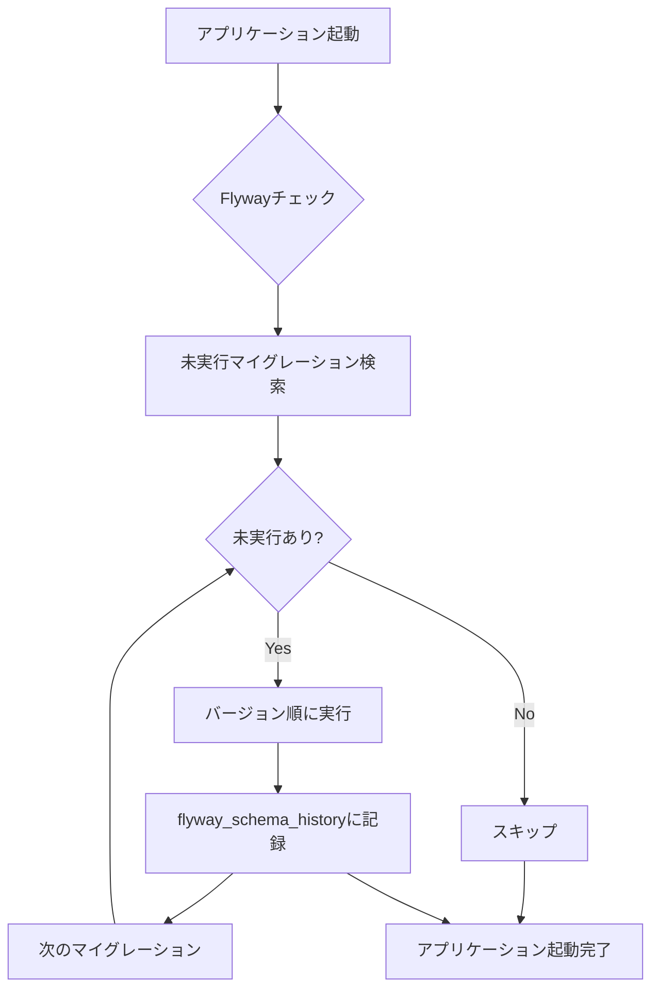

# デプロイメント戦略書

- バージョン: 1.0
- 作成日: 2025年12月30日
- 最終更新日: 2025年12月30日
- 作成者: Project Manager

---

## 1. 概要

本ドキュメントは、勤怠管理システムの各環境へのデプロイメント戦略、CI/CDパイプライン、データベースマイグレーション戦略を定義する。本番環境への安全かつ確実なリリースを実現するための手順と設定を記載する。

---

## 2. 環境構成

### 2.1. 環境一覧

| 環境 | 用途 | URL | データベース | 外部API | 自動デプロイ |
|------|------|-----|-------------|---------|-------------|
| **local** | 開発者ローカル | http://localhost:8080 | PostgreSQL (Docker) | モック | ❌ 手動 |
| **dev** | 開発統合環境 | https://dev-api.example.com | PostgreSQL (Docker) | テストアカウント | ✅ develop push時 |
| **staging** | 本番前検証 | https://staging-api.example.com | PostgreSQL (本番同構成) | テストアカウント | ✅ main push時 |
| **production** | 本番 | https://api.example.com | PostgreSQL (HA構成) | 本番アカウント | ✅ タグpush時 |

### 2.2. 環境別設定

#### local（開発者ローカル）

**目的**: 開発者が手元で機能開発・デバッグを行う環境

**特徴**:
- Docker Composeで全コンポーネントを起動
- H2インメモリDBも選択可能（高速起動）
- ホットリロード有効（spring-boot-devtools）
- すべてのログレベルをDEBUGに設定

**起動方法**:
```bash
# Docker Composeで起動
docker-compose up -d

# Spring Bootアプリケーション起動
./mvnw spring-boot:run -Dspring-boot.run.profiles=local
```

**設定ファイル**: `src/main/resources/application-local.yml`

```yaml
spring:
  datasource:
    url: jdbc:postgresql://localhost:5432/attendance_local
    username: postgres
    password: postgres
  jpa:
    show-sql: true
    hibernate:
      ddl-auto: validate  # Flywayで管理するのでvalidateのみ
  security:
    oauth2:
      client:
        registration:
          google:
            client-id: ${GOOGLE_CLIENT_ID_LOCAL}
            client-secret: ${GOOGLE_CLIENT_SECRET_LOCAL}
            redirect-uri: http://localhost:8080/api/v1/auth/callback

logging:
  level:
    root: INFO
    com.example.attendance: DEBUG
    org.springframework.security: DEBUG
    org.hibernate.SQL: DEBUG

management:
  endpoints:
    web:
      exposure:
        include: "*"  # すべてのActuatorエンドポイントを公開
```

---

#### dev（開発統合環境）

**目的**: 開発チーム全体で統合テストを行う環境

**特徴**:
- develop ブランチへのpushで自動デプロイ
- テストアカウントでGoogle API連携
- バッチジョブは手動実行のみ（自動実行OFF）
- 監視は簡易設定

**デプロイフロー**:
```
develop push → GitHub Actions → Docker build → AWS ECS (Fargate) → デプロイ完了
```

**設定ファイル**: `src/main/resources/application-dev.yml`

```yaml
spring:
  datasource:
    url: jdbc:postgresql://${DB_HOST}:5432/attendance_dev
    username: ${DB_USERNAME}
    password: ${DB_PASSWORD}
  jpa:
    show-sql: false
    hibernate:
      ddl-auto: validate

logging:
  level:
    root: INFO
    com.example.attendance: DEBUG

management:
  endpoints:
    web:
      exposure:
        include: health,info,metrics,prometheus
```

---

#### staging（本番前検証環境）

**目的**: 本番リリース前の最終検証（本番と同じ構成）

**特徴**:
- main ブランチへのpushで自動デプロイ
- 本番と同一のインフラ構成（PostgreSQL HA、Redis）
- バッチジョブは本番と同じスケジュールで実行
- 本番データの匿名化コピーを使用

**デプロイフロー**:
```
main push → GitHub Actions → セキュリティスキャン → Docker build → AWS ECS (Fargate) → smoke test → デプロイ完了
```

**設定ファイル**: `src/main/resources/application-staging.yml`

```yaml
spring:
  datasource:
    url: jdbc:postgresql://${DB_HOST}:5432/attendance_staging
    username: ${DB_USERNAME}
    password: ${DB_PASSWORD}
    hikari:
      maximum-pool-size: 10
      minimum-idle: 5
      connection-timeout: 30000

  jpa:
    show-sql: false
    hibernate:
      ddl-auto: validate

  security:
    oauth2:
      client:
        registration:
          google:
            client-id: ${GOOGLE_CLIENT_ID_STAGING}
            client-secret: ${GOOGLE_CLIENT_SECRET_STAGING}

logging:
  level:
    root: INFO
    com.example.attendance: INFO

management:
  endpoints:
    web:
      exposure:
        include: health,info,metrics,prometheus
```

---

#### production（本番環境）

**目的**: 実際のビジネス運用環境

**特徴**:
- Git タグ（例: v1.0.0）のpushで自動デプロイ
- PostgreSQL Multi-AZ構成（高可用性）
- Redis Cluster（セッション管理、キャッシュ）
- すべてのログを CloudWatch Logs / S3に保存
- 本番用Google APIアカウント

**デプロイフロー**:
```
tag push (v1.0.0) → GitHub Actions →
  ├─ セキュリティスキャン（OWASP Dependency Check）
  ├─ 統合テスト実行
  ├─ Docker build & push
  ├─ Blue/Green デプロイメント
  ├─ Smoke test
  └─ デプロイ完了通知（Slack）
```

**設定ファイル**: `src/main/resources/application-prod.yml`

```yaml
spring:
  datasource:
    url: jdbc:postgresql://${DB_HOST}:5432/attendance_prod
    username: ${DB_USERNAME}
    password: ${DB_PASSWORD}
    hikari:
      maximum-pool-size: 20
      minimum-idle: 10
      connection-timeout: 30000
      idle-timeout: 600000
      max-lifetime: 1800000

  jpa:
    show-sql: false
    hibernate:
      ddl-auto: validate
    properties:
      hibernate:
        jdbc:
          batch_size: 20
        order_inserts: true
        order_updates: true

  security:
    oauth2:
      client:
        registration:
          google:
            client-id: ${GOOGLE_CLIENT_ID_PROD}
            client-secret: ${GOOGLE_CLIENT_SECRET_PROD}
            redirect-uri: https://api.example.com/api/v1/auth/callback

logging:
  level:
    root: WARN
    com.example.attendance: INFO
  pattern:
    console: "%d{yyyy-MM-dd HH:mm:ss} - %msg%n"

management:
  endpoints:
    web:
      exposure:
        include: health,info,metrics,prometheus
  endpoint:
    health:
      show-details: when-authorized
```

---

## 3. CI/CDパイプライン

### 3.1. GitHub Actions ワークフロー

#### 3.1.1. CI（継続的インテグレーション）

**.github/workflows/ci.yml**

```yaml
name: CI Pipeline

on:
  pull_request:
    branches: [main, develop]
  push:
    branches: [main, develop]

jobs:
  test:
    name: Run Tests
    runs-on: ubuntu-latest

    services:
      postgres:
        image: postgres:15
        env:
          POSTGRES_DB: attendance_test
          POSTGRES_USER: postgres
          POSTGRES_PASSWORD: postgres
        ports:
          - 5432:5432
        options: >-
          --health-cmd pg_isready
          --health-interval 10s
          --health-timeout 5s
          --health-retries 5

    steps:
      - name: Checkout code
        uses: actions/checkout@v4

      - name: Set up JDK 17
        uses: actions/setup-java@v4
        with:
          java-version: '17'
          distribution: 'temurin'
          cache: maven

      - name: Run unit tests
        run: ./mvnw clean test

      - name: Run integration tests
        run: ./mvnw verify -P integration-test

      - name: Generate test coverage report
        run: ./mvnw jacoco:report

      - name: Upload coverage to Codecov
        uses: codecov/codecov-action@v3
        with:
          files: ./target/site/jacoco/jacoco.xml
          flags: unittests
          name: codecov-umbrella

      - name: Check coverage threshold
        run: |
          ./mvnw jacoco:check -Djacoco.haltOnFailure=true

  security-scan:
    name: Security Scan
    runs-on: ubuntu-latest

    steps:
      - name: Checkout code
        uses: actions/checkout@v4

      - name: Set up JDK 17
        uses: actions/setup-java@v4
        with:
          java-version: '17'
          distribution: 'temurin'
          cache: maven

      - name: OWASP Dependency Check
        run: ./mvnw dependency-check:check

      - name: Upload OWASP report
        if: always()
        uses: actions/upload-artifact@v3
        with:
          name: dependency-check-report
          path: target/dependency-check-report.html

      - name: SonarQube Scan
        env:
          SONAR_TOKEN: ${{ secrets.SONAR_TOKEN }}
        run: |
          ./mvnw sonar:sonar \
            -Dsonar.projectKey=attendance-management \
            -Dsonar.host.url=${{ secrets.SONAR_HOST_URL }}

  build:
    name: Build Application
    runs-on: ubuntu-latest
    needs: [test, security-scan]

    steps:
      - name: Checkout code
        uses: actions/checkout@v4

      - name: Set up JDK 17
        uses: actions/setup-java@v4
        with:
          java-version: '17'
          distribution: 'temurin'
          cache: maven

      - name: Build with Maven
        run: ./mvnw clean package -DskipTests

      - name: Build Docker image
        run: |
          docker build -t attendance-api:${{ github.sha }} .

      - name: Save Docker image
        run: |
          docker save attendance-api:${{ github.sha }} | gzip > attendance-api.tar.gz

      - name: Upload artifact
        uses: actions/upload-artifact@v3
        with:
          name: docker-image
          path: attendance-api.tar.gz
```

---

#### 3.1.2. CD（継続的デプロイメント - Dev環境）

**.github/workflows/deploy-dev.yml**

```yaml
name: Deploy to Dev

on:
  push:
    branches:
      - develop

jobs:
  deploy:
    name: Deploy to Dev Environment
    runs-on: ubuntu-latest

    steps:
      - name: Checkout code
        uses: actions/checkout@v4

      - name: Set up JDK 17
        uses: actions/setup-java@v4
        with:
          java-version: '17'
          distribution: 'temurin'
          cache: maven

      - name: Build application
        run: ./mvnw clean package -DskipTests

      - name: Configure AWS credentials
        uses: aws-actions/configure-aws-credentials@v4
        with:
          aws-access-key-id: ${{ secrets.AWS_ACCESS_KEY_ID }}
          aws-secret-access-key: ${{ secrets.AWS_SECRET_ACCESS_KEY }}
          aws-region: ap-northeast-1

      - name: Login to Amazon ECR
        id: login-ecr
        uses: aws-actions/amazon-ecr-login@v2

      - name: Build and push Docker image
        env:
          ECR_REGISTRY: ${{ steps.login-ecr.outputs.registry }}
          ECR_REPOSITORY: attendance-api-dev
          IMAGE_TAG: ${{ github.sha }}
        run: |
          docker build -t $ECR_REGISTRY/$ECR_REPOSITORY:$IMAGE_TAG .
          docker tag $ECR_REGISTRY/$ECR_REPOSITORY:$IMAGE_TAG $ECR_REGISTRY/$ECR_REPOSITORY:latest
          docker push $ECR_REGISTRY/$ECR_REPOSITORY:$IMAGE_TAG
          docker push $ECR_REGISTRY/$ECR_REPOSITORY:latest

      - name: Deploy to ECS
        run: |
          aws ecs update-service \
            --cluster attendance-dev-cluster \
            --service attendance-api-service \
            --force-new-deployment

      - name: Wait for deployment
        run: |
          aws ecs wait services-stable \
            --cluster attendance-dev-cluster \
            --services attendance-api-service

      - name: Notify Slack
        if: always()
        uses: slackapi/slack-github-action@v1
        with:
          payload: |
            {
              "text": "Dev Deployment: ${{ job.status }}",
              "blocks": [
                {
                  "type": "section",
                  "text": {
                    "type": "mrkdwn",
                    "text": "Dev環境へのデプロイが完了しました\n*Status:* ${{ job.status }}\n*Commit:* ${{ github.sha }}\n*Author:* ${{ github.actor }}"
                  }
                }
              ]
            }
        env:
          SLACK_WEBHOOK_URL: ${{ secrets.SLACK_WEBHOOK_URL }}
```

---

#### 3.1.3. CD（継続的デプロイメント - Production環境）

**.github/workflows/deploy-prod.yml**

```yaml
name: Deploy to Production

on:
  push:
    tags:
      - 'v*.*.*'

jobs:
  deploy:
    name: Deploy to Production
    runs-on: ubuntu-latest
    environment:
      name: production
      url: https://api.example.com

    steps:
      - name: Checkout code
        uses: actions/checkout@v4

      - name: Set up JDK 17
        uses: actions/setup-java@v4
        with:
          java-version: '17'
          distribution: 'temurin'
          cache: maven

      - name: Run full test suite
        run: ./mvnw clean verify

      - name: Security scan
        run: ./mvnw dependency-check:check

      - name: Build application
        run: ./mvnw clean package -DskipTests

      - name: Configure AWS credentials
        uses: aws-actions/configure-aws-credentials@v4
        with:
          aws-access-key-id: ${{ secrets.AWS_ACCESS_KEY_ID_PROD }}
          aws-secret-access-key: ${{ secrets.AWS_SECRET_ACCESS_KEY_PROD }}
          aws-region: ap-northeast-1

      - name: Login to Amazon ECR
        id: login-ecr
        uses: aws-actions/amazon-ecr-login@v2

      - name: Build and push Docker image
        env:
          ECR_REGISTRY: ${{ steps.login-ecr.outputs.registry }}
          ECR_REPOSITORY: attendance-api-prod
          IMAGE_TAG: ${{ github.ref_name }}
        run: |
          docker build -t $ECR_REGISTRY/$ECR_REPOSITORY:$IMAGE_TAG .
          docker tag $ECR_REGISTRY/$ECR_REPOSITORY:$IMAGE_TAG $ECR_REGISTRY/$ECR_REPOSITORY:latest
          docker push $ECR_REGISTRY/$ECR_REPOSITORY:$IMAGE_TAG
          docker push $ECR_REGISTRY/$ECR_REPOSITORY:latest

      - name: Update ECS task definition
        id: task-def
        uses: aws-actions/amazon-ecs-render-task-definition@v1
        with:
          task-definition: .aws/task-definition-prod.json
          container-name: attendance-api
          image: ${{ steps.login-ecr.outputs.registry }}/attendance-api-prod:${{ github.ref_name }}

      - name: Deploy to ECS (Blue/Green)
        uses: aws-actions/amazon-ecs-deploy-task-definition@v1
        with:
          task-definition: ${{ steps.task-def.outputs.task-definition }}
          service: attendance-api-service
          cluster: attendance-prod-cluster
          wait-for-service-stability: true
          codedeploy-appspec: .aws/appspec.yml
          codedeploy-application: attendance-api
          codedeploy-deployment-group: attendance-api-deployment-group

      - name: Run smoke tests
        run: |
          sleep 30
          curl -f https://api.example.com/health || exit 1
          curl -f https://api.example.com/api/v1/health/ready || exit 1

      - name: Create GitHub Release
        uses: actions/create-release@v1
        env:
          GITHUB_TOKEN: ${{ secrets.GITHUB_TOKEN }}
        with:
          tag_name: ${{ github.ref_name }}
          release_name: Release ${{ github.ref_name }}
          draft: false
          prerelease: false

      - name: Notify Slack
        if: always()
        uses: slackapi/slack-github-action@v1
        with:
          payload: |
            {
              "text": "Production Deployment: ${{ job.status }}",
              "blocks": [
                {
                  "type": "section",
                  "text": {
                    "type": "mrkdwn",
                    "text": ":rocket: 本番環境へのデプロイが完了しました\n*Status:* ${{ job.status }}\n*Version:* ${{ github.ref_name }}\n*Deployer:* ${{ github.actor }}"
                  }
                }
              ]
            }
        env:
          SLACK_WEBHOOK_URL: ${{ secrets.SLACK_WEBHOOK_URL }}
```

---

## 4. データベースマイグレーション戦略

### 4.1. Flyway設定

**pom.xml**

```xml
<dependency>
    <groupId>org.flywaydb</groupId>
    <artifactId>flyway-core</artifactId>
</dependency>
<dependency>
    <groupId>org.flywaydb</groupId>
    <artifactId>flyway-database-postgresql</artifactId>
</dependency>
```

**application.yml（共通設定）**

```yaml
spring:
  flyway:
    enabled: true
    baseline-on-migrate: true
    baseline-version: 0
    locations: classpath:db/migration
    validate-on-migrate: true
    out-of-order: false
```

### 4.2. マイグレーションファイル構成

```
src/main/resources/db/migration/
├── V1__initial_schema.sql
├── V2__add_audit_columns.sql
├── V3__add_payroll_histories_table.sql
├── V4__add_audit_logs_table.sql
├── V5__add_batch_job_histories_table.sql
├── V6__add_indexes.sql
└── V7__add_triggers.sql
```

### 4.3. マイグレーションファイル例

**V1__initial_schema.sql**

```sql
-- ============================================
-- 従業員テーブル
-- ============================================
CREATE TABLE employees (
    id SERIAL PRIMARY KEY,
    email VARCHAR(255) UNIQUE NOT NULL,
    name VARCHAR(255) NOT NULL,
    role VARCHAR(20) NOT NULL DEFAULT 'USER' CHECK (role IN ('ADMIN', 'USER')),
    is_active BOOLEAN NOT NULL DEFAULT TRUE,
    google_refresh_token_encrypted TEXT,
    last_synced_at TIMESTAMP,
    created_at TIMESTAMP NOT NULL DEFAULT CURRENT_TIMESTAMP,
    updated_at TIMESTAMP NOT NULL DEFAULT CURRENT_TIMESTAMP
);

CREATE INDEX idx_employees_email ON employees(email);
CREATE INDEX idx_employees_active ON employees(is_active);

-- ============================================
-- 勤務形態テーブル
-- ============================================
CREATE TABLE work_types (
    id SERIAL PRIMARY KEY,
    name VARCHAR(100) UNIQUE NOT NULL,
    calendar_keyword VARCHAR(50) UNIQUE NOT NULL,
    is_payroll_target BOOLEAN NOT NULL DEFAULT TRUE,
    rate_type VARCHAR(20) NOT NULL CHECK (rate_type IN ('FIXED', 'STUDENT_LEVEL_BASED')),
    fixed_wage INTEGER CHECK (fixed_wage IS NULL OR fixed_wage > 0),
    created_at TIMESTAMP NOT NULL DEFAULT CURRENT_TIMESTAMP,
    updated_at TIMESTAMP NOT NULL DEFAULT CURRENT_TIMESTAMP
);

-- 他のテーブルも同様に定義...
```

**V2__add_audit_columns.sql**

```sql
-- 監査カラムの追加
ALTER TABLE employees ADD COLUMN created_by INTEGER REFERENCES employees(id);
ALTER TABLE employees ADD COLUMN updated_by INTEGER REFERENCES employees(id);

ALTER TABLE work_types ADD COLUMN created_by INTEGER REFERENCES employees(id);
ALTER TABLE work_types ADD COLUMN updated_by INTEGER REFERENCES employees(id);

-- 他のテーブルも同様...
```

### 4.4. マイグレーション実行フロー



### 4.5. マイグレーション運用ルール

#### ✅ DO（推奨事項）

1. **バージョン番号を連番で付与**
   - 例: V1, V2, V3...

2. **説明的なファイル名を使用**
   - 例: `V3__add_student_level_column.sql`

3. **本番適用前にstagingで検証**
   - stagingで成功 → 本番適用

4. **ロールバック用Undoスクリプトを作成**
   - 例: `U3__undo_add_student_level_column.sql`

5. **ALTER TABLEは慎重に（ダウンタイム考慮）**
   - カラム追加: NULL許可 or デフォルト値設定
   - インデックス作成: CONCURRENTLY オプション使用

#### ❌ DON'T（禁止事項）

1. **適用済みマイグレーションを修正しない**
   - 新しいバージョンで修正を追加

2. **手動でDBスキーマを変更しない**
   - すべてFlywayで管理

3. **本番で直接マイグレーションをテストしない**
   - 必ずstaging経由

---

## 5. Docker設定

### 5.1. Dockerfile

```dockerfile
# ============================================
# ビルドステージ
# ============================================
FROM maven:3.9-eclipse-temurin-17 AS build

WORKDIR /app

# 依存関係のキャッシュ
COPY pom.xml .
RUN mvn dependency:go-offline -B

# ソースコードをコピーしてビルド
COPY src ./src
RUN mvn clean package -DskipTests

# ============================================
# 実行ステージ
# ============================================
FROM eclipse-temurin:17-jre-alpine

WORKDIR /app

# セキュリティ: 非rootユーザーで実行
RUN addgroup -g 1001 -S appuser && \
    adduser -u 1001 -S appuser -G appuser

# JARファイルをコピー
COPY --from=build /app/target/*.jar app.jar

# ヘルスチェックスクリプト
COPY docker-healthcheck.sh /app/
RUN chmod +x /app/docker-healthcheck.sh

# 所有権を変更
RUN chown -R appuser:appuser /app

USER appuser

# ヘルスチェック
HEALTHCHECK --interval=30s --timeout=3s --start-period=40s --retries=3 \
    CMD /app/docker-healthcheck.sh

EXPOSE 8080

ENTRYPOINT ["java", \
    "-XX:+UseContainerSupport", \
    "-XX:MaxRAMPercentage=75.0", \
    "-Djava.security.egd=file:/dev/./urandom", \
    "-jar", \
    "app.jar"]
```

**docker-healthcheck.sh**

```bash
#!/bin/sh
curl -f http://localhost:8080/health || exit 1
```

### 5.2. docker-compose.yml（ローカル開発用）

```yaml
version: '3.8'

services:
  postgres:
    image: postgres:15-alpine
    container_name: attendance-db
    environment:
      POSTGRES_DB: attendance_local
      POSTGRES_USER: postgres
      POSTGRES_PASSWORD: postgres
    ports:
      - "5432:5432"
    volumes:
      - postgres-data:/var/lib/postgresql/data
    healthcheck:
      test: ["CMD-SHELL", "pg_isready -U postgres"]
      interval: 10s
      timeout: 5s
      retries: 5

  redis:
    image: redis:7-alpine
    container_name: attendance-redis
    ports:
      - "6379:6379"
    healthcheck:
      test: ["CMD", "redis-cli", "ping"]
      interval: 10s
      timeout: 3s
      retries: 5

  app:
    build:
      context: .
      dockerfile: Dockerfile
    container_name: attendance-api
    depends_on:
      postgres:
        condition: service_healthy
      redis:
        condition: service_healthy
    environment:
      SPRING_PROFILES_ACTIVE: local
      SPRING_DATASOURCE_URL: jdbc:postgresql://postgres:5432/attendance_local
      SPRING_DATASOURCE_USERNAME: postgres
      SPRING_DATASOURCE_PASSWORD: postgres
      SPRING_DATA_REDIS_HOST: redis
      SPRING_DATA_REDIS_PORT: 6379
    ports:
      - "8080:8080"
    volumes:
      - ./logs:/app/logs

volumes:
  postgres-data:
```

---

## 6. AWS ECS/Fargate設定

### 6.1. タスク定義（production）

**.aws/task-definition-prod.json**

```json
{
  "family": "attendance-api-prod",
  "networkMode": "awsvpc",
  "requiresCompatibilities": ["FARGATE"],
  "cpu": "1024",
  "memory": "2048",
  "executionRoleArn": "arn:aws:iam::123456789012:role/ecsTaskExecutionRole",
  "taskRoleArn": "arn:aws:iam::123456789012:role/attendanceApiTaskRole",
  "containerDefinitions": [
    {
      "name": "attendance-api",
      "image": "123456789012.dkr.ecr.ap-northeast-1.amazonaws.com/attendance-api-prod:latest",
      "essential": true,
      "portMappings": [
        {
          "containerPort": 8080,
          "protocol": "tcp"
        }
      ],
      "environment": [
        {
          "name": "SPRING_PROFILES_ACTIVE",
          "value": "prod"
        }
      ],
      "secrets": [
        {
          "name": "DB_HOST",
          "valueFrom": "arn:aws:secretsmanager:ap-northeast-1:123456789012:secret:attendance/db-host"
        },
        {
          "name": "DB_USERNAME",
          "valueFrom": "arn:aws:secretsmanager:ap-northeast-1:123456789012:secret:attendance/db-username"
        },
        {
          "name": "DB_PASSWORD",
          "valueFrom": "arn:aws:secretsmanager:ap-northeast-1:123456789012:secret:attendance/db-password"
        },
        {
          "name": "GOOGLE_CLIENT_ID_PROD",
          "valueFrom": "arn:aws:secretsmanager:ap-northeast-1:123456789012:secret:attendance/google-client-id"
        },
        {
          "name": "GOOGLE_CLIENT_SECRET_PROD",
          "valueFrom": "arn:aws:secretsmanager:ap-northeast-1:123456789012:secret:attendance/google-client-secret"
        }
      ],
      "logConfiguration": {
        "logDriver": "awslogs",
        "options": {
          "awslogs-group": "/ecs/attendance-api-prod",
          "awslogs-region": "ap-northeast-1",
          "awslogs-stream-prefix": "ecs"
        }
      },
      "healthCheck": {
        "command": ["CMD-SHELL", "curl -f http://localhost:8080/health || exit 1"],
        "interval": 30,
        "timeout": 5,
        "retries": 3,
        "startPeriod": 60
      }
    }
  ]
}
```

### 6.2. Blue/Green デプロイメント設定

**.aws/appspec.yml**

```yaml
version: 0.0
Resources:
  - TargetService:
      Type: AWS::ECS::Service
      Properties:
        TaskDefinition: "<TASK_DEFINITION>"
        LoadBalancerInfo:
          ContainerName: "attendance-api"
          ContainerPort: 8080
        PlatformVersion: "LATEST"
        NetworkConfiguration:
          AwsvpcConfiguration:
            Subnets:
              - "subnet-12345678"
              - "subnet-87654321"
            SecurityGroups:
              - "sg-12345678"
            AssignPublicIp: "DISABLED"

Hooks:
  - BeforeInstall: "LambdaFunctionToValidateBeforeInstall"
  - AfterInstall: "LambdaFunctionToValidateAfterInstall"
  - AfterAllowTestTraffic: "LambdaFunctionToValidateAfterTestTrafficStarts"
  - BeforeAllowTraffic: "LambdaFunctionToValidateBeforeAllowingProductionTraffic"
  - AfterAllowTraffic: "LambdaFunctionToValidateAfterAllowingProductionTraffic"
```

---

## 7. 環境変数管理

### 7.1. AWS Secrets Manager

**シークレット一覧**:

| シークレット名 | 説明 | 環境 |
|--------------|------|------|
| `attendance/db-host` | PostgreSQLホスト名 | dev/staging/prod |
| `attendance/db-username` | DBユーザー名 | dev/staging/prod |
| `attendance/db-password` | DBパスワード | dev/staging/prod |
| `attendance/google-client-id` | Google OAuth クライアントID | dev/staging/prod |
| `attendance/google-client-secret` | Google OAuth クライアントシークレット | dev/staging/prod |
| `attendance/jwt-private-key` | JWT署名用秘密鍵 | dev/staging/prod |
| `attendance/jwt-public-key` | JWT検証用公開鍵 | dev/staging/prod |
| `attendance/encryption-key` | データ暗号化キー | dev/staging/prod |

### 7.2. ローカル開発用 .env ファイル

**.env.example**（Gitにコミット）

```bash
# Database
DB_HOST=localhost
DB_USERNAME=postgres
DB_PASSWORD=postgres

# Google OAuth
GOOGLE_CLIENT_ID_LOCAL=your-client-id.apps.googleusercontent.com
GOOGLE_CLIENT_SECRET_LOCAL=your-client-secret

# JWT
JWT_PRIVATE_KEY=path/to/private-key.pem
JWT_PUBLIC_KEY=path/to/public-key.pem

# Encryption
ENCRYPTION_KEY=your-32-character-encryption-key
```

**.env**（Gitで除外、各開発者が作成）

```bash
# 実際の値を記載（.gitignoreに追加）
```

---

## 8. ロールバック戦略

### 8.1. アプリケーションロールバック

**GitHub Actionsによる自動ロールバック**:

```yaml
- name: Rollback on failure
  if: failure()
  run: |
    # 前回のタスク定義に戻す
    aws ecs update-service \
      --cluster attendance-prod-cluster \
      --service attendance-api-service \
      --task-definition attendance-api-prod:${{ env.PREVIOUS_TASK_DEFINITION_REVISION }}
```

**手動ロールバック手順**:

```bash
# 1. 前回のタスク定義を確認
aws ecs list-task-definitions --family-prefix attendance-api-prod

# 2. ロールバック実行
aws ecs update-service \
  --cluster attendance-prod-cluster \
  --service attendance-api-service \
  --task-definition attendance-api-prod:42  # 前回のリビジョン番号
```

### 8.2. データベースロールバック

**Flyway Undoスクリプト**（Flyway Teamsエディション使用時）:

```sql
-- U3__undo_add_student_level_column.sql
ALTER TABLE students DROP COLUMN student_level_id;
```

**手動ロールバック**:

```bash
# 1. バックアップから復元
pg_restore -d attendance_prod backup_2025_12_30.dump

# 2. または特定のマイグレーションのみ取り消し
psql -d attendance_prod -f rollback_scripts/undo_v3.sql
```

---

## 9. デプロイチェックリスト

### 9.1. リリース前チェックリスト

- [ ] すべてのテストがパス（単体・統合・E2E）
- [ ] コードカバレッジが80%以上
- [ ] セキュリティスキャンで重大な脆弱性なし
- [ ] Staging環境で動作確認完了
- [ ] データベースマイグレーションスクリプト検証済み
- [ ] ロールバック手順を確認
- [ ] 本番データのバックアップ取得
- [ ] リリースノート作成
- [ ] 関係者への事前通知（Slack/メール）
- [ ] モニタリングダッシュボード準備完了

### 9.2. リリース後チェックリスト

- [ ] ヘルスチェックエンドポイントが正常
- [ ] Smoke testがパス
- [ ] エラーログに異常なし
- [ ] メトリクスが正常範囲内
- [ ] バッチジョブが正常実行
- [ ] リリース完了通知（Slack/メール）

---

## 10. トラブルシューティング

### 10.1. よくある問題と対処法

| 問題 | 原因 | 対処法 |
|------|------|--------|
| デプロイが失敗する | タスク定義のメモリ不足 | CPU/メモリを増やす |
| ヘルスチェック失敗 | 起動に時間がかかる | `startPeriod`を延長 |
| DBマイグレーション失敗 | 権限不足 | DBユーザーの権限を確認 |
| 環境変数が読み込めない | Secrets Manager権限不足 | IAMロールを確認 |
| デプロイ後にエラー急増 | コードのバグ | 即座にロールバック |

---

## 11. まとめ

本デプロイメント戦略により、以下を実現する:

1. ✅ **自動化されたCI/CD**: コミットからデプロイまで完全自動化
2. ✅ **安全なリリース**: Blue/Greenデプロイメントでダウンタイムゼロ
3. ✅ **データベース管理**: Flywayによる確実なスキーマ管理
4. ✅ **ロールバック対応**: 問題発生時の迅速な復旧
5. ✅ **セキュリティ**: Secrets Managerによる機密情報管理

すべての環境が適切に管理され、本番リリースが安全に実施できる体制が整っている。
