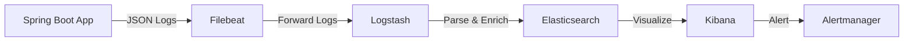

# ログ戦略書

- バージョン: 1.0
- 作成日: 2025年12月30日
- 最終更新日: 2025年12月30日
- 作成者: Project Manager

---

## 1. 概要

本ドキュメントは、勤怠管理システムのログ戦略を定義する。構造化ログ、ログレベル、個人情報のマスキング、ログ保持期間、運用監視のためのログ設計を包括的に記述する。

## 2. ログ方針

### 2.1. 基本原則

1. **構造化**: すべてのログはJSON形式で出力し、検索・分析を容易にする
2. **トレーサビリティ**: すべてのログにトレースIDを付与し、リクエスト追跡を可能にする
3. **セキュリティ**: 個人情報は必ずマスキングする
4. **パフォーマンス**: ログ出力がアプリケーションのパフォーマンスに悪影響を与えない
5. **保持期間**: 法令遵守と運用効率のバランスを考慮した保持期間を設定

### 2.2. ログフレームワーク

- **ロギングフレームワーク**: Logback (Spring Boot標準)
- **構造化ログ**: logstash-logback-encoder
- **MDC（Mapped Diagnostic Context）**: リクエスト固有の情報を保持

## 3. ログレベル定義

### 3.1. ログレベルと用途

| レベル | 用途 | 出力条件 | 例 |
|--------|------|---------|-----|
| **ERROR** | 即時対応が必要なエラー | 本番環境でも常に出力 | DB接続失敗、予期しない例外、Google API認証エラー |
| **WARN** | 注意が必要だが処理は継続 | 本番環境でも常に出力 | 生徒マスタに存在しない生徒名、リトライ実行、レート制限超過 |
| **INFO** | 重要な業務イベント | 本番環境でも常に出力 | ログイン成功、給与計算実行、バッチ開始/終了、API呼び出し |
| **DEBUG** | デバッグ情報 | 開発・ステージング環境のみ | SQLクエリ、APIレスポンス詳細、内部処理の詳細 |
| **TRACE** | 非常に詳細なデバッグ情報 | 開発環境のみ | メソッド呼び出しトレース、変数の値 |

### 3.2. 環境別ログレベル設定

```yaml
# application-local.yml (開発環境)
logging:
  level:
    root: INFO
    com.example.attendance: DEBUG
    org.springframework.web: DEBUG
    org.hibernate.SQL: DEBUG

# application-production.yml (本番環境)
logging:
  level:
    root: INFO
    com.example.attendance: INFO
    org.springframework.web: WARN
    org.hibernate.SQL: WARN
```

## 4. 構造化ログフォーマット

### 4.1. ログ出力フォーマット（JSON）

```json
{
  "timestamp": "2025-12-30T10:00:00.123Z",
  "level": "INFO",
  "logger": "com.example.attendance.service.PayrollService",
  "thread": "http-nio-8080-exec-1",
  "message": "Payroll calculation completed",
  "context": {
    "employeeId": 1,
    "startDate": "2025-11-01",
    "endDate": "2025-11-30",
    "totalPayment": 216000,
    "executionTimeMs": 234
  },
  "traceId": "abc123xyz",
  "spanId": "def456uvw",
  "userId": "admin@example.com",
  "userRole": "ADMIN",
  "requestUri": "/api/v1/payrolls",
  "httpMethod": "GET",
  "statusCode": 200,
  "clientIp": "192.168.1.100",
  "userAgent": "Mozilla/5.0 (Windows NT 10.0; Win64; x64) AppleWebKit/537.36"
}
```

### 4.2. logback-spring.xml設定

```xml
<?xml version="1.0" encoding="UTF-8"?>
<configuration>
    <include resource="org/springframework/boot/logging/logback/defaults.xml"/>

    <property name="LOG_FILE" value="${LOG_FILE:-${LOG_PATH:-${LOG_TEMP:-${java.io.tmpdir:-/tmp}}/}spring.log}"/>

    <!-- Console Appender（開発環境） -->
    <appender name="CONSOLE" class="ch.qos.logback.core.ConsoleAppender">
        <encoder class="net.logstash.logback.encoder.LogstashEncoder">
            <includeContext>false</includeContext>
            <customFields>{"app":"attendance-management"}</customFields>
        </encoder>
    </appender>

    <!-- File Appender（本番環境） -->
    <appender name="FILE" class="ch.qos.logback.core.rolling.RollingFileAppender">
        <file>${LOG_FILE}</file>
        <encoder class="net.logstash.logback.encoder.LogstashEncoder">
            <includeContext>false</includeContext>
            <customFields>{"app":"attendance-management"}</customFields>
        </encoder>
        <rollingPolicy class="ch.qos.logback.core.rolling.SizeAndTimeBasedRollingPolicy">
            <fileNamePattern>${LOG_FILE}.%d{yyyy-MM-dd}.%i.gz</fileNamePattern>
            <maxFileSize>100MB</maxFileSize>
            <maxHistory>90</maxHistory>  <!-- 90日間保持 -->
            <totalSizeCap>10GB</totalSizeCap>
        </rollingPolicy>
    </appender>

    <!-- エラーログ専用（本番環境） -->
    <appender name="ERROR_FILE" class="ch.qos.logback.core.rolling.RollingFileAppender">
        <file>${LOG_PATH}/error.log</file>
        <filter class="ch.qos.logback.classic.filter.ThresholdFilter">
            <level>ERROR</level>
        </filter>
        <encoder class="net.logstash.logback.encoder.LogstashEncoder"/>
        <rollingPolicy class="ch.qos.logback.core.rolling.SizeAndTimeBasedRollingPolicy">
            <fileNamePattern>${LOG_PATH}/error.%d{yyyy-MM-dd}.%i.gz</fileNamePattern>
            <maxFileSize>50MB</maxFileSize>
            <maxHistory>180</maxHistory>  <!-- 180日間保持 -->
        </rollingPolicy>
    </appender>

    <!-- プロファイル別設定 -->
    <springProfile name="local,dev">
        <root level="INFO">
            <appender-ref ref="CONSOLE"/>
        </root>
    </springProfile>

    <springProfile name="production">
        <root level="INFO">
            <appender-ref ref="FILE"/>
            <appender-ref ref="ERROR_FILE"/>
        </root>
    </springProfile>
</configuration>
```

## 5. 分散トレーシング

### 5.1. トレースIDの付与

すべてのリクエストに一意のトレースIDを付与し、ログに記録する。

```java
@Component
public class TraceIdFilter extends OncePerRequestFilter {

    @Override
    protected void doFilterInternal(
        HttpServletRequest request,
        HttpServletResponse response,
        FilterChain filterChain
    ) throws ServletException, IOException {

        String traceId = request.getHeader("X-Trace-Id");
        if (traceId == null || traceId.isEmpty()) {
            traceId = UUID.randomUUID().toString();
        }

        MDC.put("traceId", traceId);
        MDC.put("spanId", UUID.randomUUID().toString());

        // レスポンスヘッダーにも設定
        response.setHeader("X-Trace-Id", traceId);

        try {
            filterChain.doFilter(request, response);
        } finally {
            MDC.clear();
        }
    }
}
```

### 5.2. MDC（Mapped Diagnostic Context）の活用

```java
@Component
public class UserContextFilter extends OncePerRequestFilter {

    @Override
    protected void doFilterInternal(
        HttpServletRequest request,
        HttpServletResponse response,
        FilterChain filterChain
    ) throws ServletException, IOException {

        Authentication auth = SecurityContextHolder.getContext().getAuthentication();
        if (auth != null && auth.isAuthenticated()) {
            MDC.put("userId", auth.getName());
            MDC.put("userRole", auth.getAuthorities().toString());
        }

        MDC.put("requestUri", request.getRequestURI());
        MDC.put("httpMethod", request.getMethod());
        MDC.put("clientIp", request.getRemoteAddr());
        MDC.put("userAgent", request.getHeader("User-Agent"));

        try {
            filterChain.doFilter(request, response);
        } finally {
            // ユーザーコンテキストのみクリア（traceIdは残す）
            MDC.remove("userId");
            MDC.remove("userRole");
            MDC.remove("requestUri");
            MDC.remove("httpMethod");
            MDC.remove("clientIp");
            MDC.remove("userAgent");
        }
    }
}
```

## 6. 個人情報のマスキング

### 6.1. マスキング対象

- メールアドレス
- 従業員名
- 生徒名
- IPアドレス（部分マスキング）
- Googleリフレッシュトークン（完全マスキング）

### 6.2. SensitiveDataMasker実装

```java
@Component
public class SensitiveDataMasker {

    /**
     * メールアドレスのマスキング
     * 例: user@example.com → u***@example.com
     */
    public String maskEmail(String email) {
        if (email == null || email.isEmpty()) {
            return email;
        }

        int atIndex = email.indexOf('@');
        if (atIndex <= 0) {
            return "***";
        }

        String localPart = email.substring(0, atIndex);
        String domain = email.substring(atIndex);

        if (localPart.length() <= 1) {
            return localPart + "***" + domain;
        }

        return localPart.charAt(0) + "***" + domain;
    }

    /**
     * 名前のマスキング
     * 例: 山田太郎 → 山田**
     */
    public String maskName(String name) {
        if (name == null || name.isEmpty()) {
            return name;
        }

        if (name.length() <= 2) {
            return name.charAt(0) + "*";
        }

        return name.substring(0, 2) + "*".repeat(name.length() - 2);
    }

    /**
     * IPアドレスのマスキング
     * 例: 192.168.1.100 → 192.168.***.***
     */
    public String maskIpAddress(String ip) {
        if (ip == null || ip.isEmpty()) {
            return ip;
        }

        String[] parts = ip.split("\\.");
        if (parts.length == 4) {
            return parts[0] + "." + parts[1] + ".***. ***";
        }

        return "***";
    }

    /**
     * トークンの完全マスキング
     */
    public String maskToken(String token) {
        return "***REDACTED***";
    }
}
```

### 6.3. ログ出力時の自動マスキング

```java
@Component
@Aspect
@Slf4j
public class SensitiveDataLoggingAspect {

    @Autowired
    private SensitiveDataMasker masker;

    @Around("execution(* com.example.attendance..*(..))")
    public Object maskSensitiveData(ProceedingJoinPoint joinPoint) throws Throwable {
        Object result = joinPoint.proceed();

        if (log.isDebugEnabled()) {
            Object[] args = joinPoint.getArgs();
            Object[] maskedArgs = maskArguments(args);

            log.debug("Method: {}, Args: {}, Result: {}",
                joinPoint.getSignature().toShortString(),
                maskedArgs,
                maskResult(result)
            );
        }

        return result;
    }

    private Object[] maskArguments(Object[] args) {
        // 引数内の個人情報をマスキング
        // ... 実装
        return args;
    }

    private Object maskResult(Object result) {
        // 戻り値内の個人情報をマスキング
        // ... 実装
        return result;
    }
}
```

## 7. ログ出力例

### 7.1. API呼び出しログ

```java
@RestController
@RequestMapping("/api/v1/employees")
@Slf4j
public class EmployeeController {

    @GetMapping("/{id}")
    public ResponseEntity<EmployeeDto> getEmployee(@PathVariable Integer id) {
        log.info("Getting employee",
            kv("employeeId", id),
            kv("traceId", MDC.get("traceId"))
        );

        try {
            EmployeeDto employee = employeeService.getEmployee(id);

            log.info("Employee retrieved successfully",
                kv("employeeId", id),
                kv("employeeName", masker.maskName(employee.getName()))
            );

            return ResponseEntity.ok(employee);

        } catch (ResourceNotFoundException ex) {
            log.warn("Employee not found",
                kv("employeeId", id),
                kv("errorCode", ex.getErrorCode())
            );
            throw ex;
        }
    }
}
```

**出力されるログ（JSON）**:
```json
{
  "timestamp": "2025-12-30T10:00:00.123Z",
  "level": "INFO",
  "logger": "com.example.attendance.controller.EmployeeController",
  "message": "Getting employee",
  "employeeId": 1,
  "traceId": "abc123xyz",
  "userId": "admin@example.com",
  "requestUri": "/api/v1/employees/1",
  "httpMethod": "GET"
}
```

### 7.2. 給与計算ログ

```java
@Service
@Slf4j
public class PayrollService {

    public PayrollDto calculatePayroll(Integer employeeId, LocalDate start, LocalDate end) {
        Instant startTime = Instant.now();

        log.info("Payroll calculation started",
            kv("employeeId", employeeId),
            kv("startDate", start),
            kv("endDate", end)
        );

        try {
            PayrollDto payroll = performCalculation(employeeId, start, end);

            long executionTime = Duration.between(startTime, Instant.now()).toMillis();

            log.info("Payroll calculation completed",
                kv("employeeId", employeeId),
                kv("totalPayment", payroll.getTotalPayment().getAmount()),
                kv("totalWorkMinutes", payroll.getTotalWorkMinutes()),
                kv("executionTimeMs", executionTime)
            );

            return payroll;

        } catch (Exception ex) {
            log.error("Payroll calculation failed",
                kv("employeeId", employeeId),
                kv("startDate", start),
                kv("endDate", end),
                kv("errorMessage", ex.getMessage()),
                ex
            );
            throw ex;
        }
    }
}
```

### 7.3. バッチ処理ログ

```java
@Component
@Slf4j
public class CalendarSyncJob {

    @Scheduled(cron = "0 0 * * * *")
    public void execute() {
        Instant startTime = Instant.now();
        String jobId = UUID.randomUUID().toString();

        log.info("Calendar sync job started",
            kv("jobId", jobId),
            kv("jobName", "CalendarSyncJob")
        );

        int successCount = 0;
        int failureCount = 0;

        try {
            List<Employee> employees = employeeRepository.findByIsActiveTrue();

            log.info("Processing employees",
                kv("jobId", jobId),
                kv("totalEmployees", employees.size())
            );

            for (Employee employee : employees) {
                try {
                    syncEmployeeCalendar(employee);
                    successCount++;
                } catch (Exception ex) {
                    failureCount++;
                    log.error("Failed to sync calendar for employee",
                        kv("jobId", jobId),
                        kv("employeeId", employee.getId()),
                        kv("errorMessage", ex.getMessage()),
                        ex
                    );
                }
            }
        } finally {
            Duration duration = Duration.between(startTime, Instant.now());

            log.info("Calendar sync job completed",
                kv("jobId", jobId),
                kv("successCount", successCount),
                kv("failureCount", failureCount),
                kv("durationMs", duration.toMillis())
            );
        }
    }
}
```

## 8. ログ保持期間

### 8.1. 環境別保持期間

| 環境 | アプリケーションログ | エラーログ | 監査ログ |
|------|-------------------|----------|---------|
| **local** | 1日 | 7日 | N/A |
| **dev** | 7日 | 30日 | 30日 |
| **staging** | 30日 | 90日 | 90日 |
| **production** | **90日（HOT）** | **180日（HOT）** | **5年（COLD）** |

### 8.2. ログアーカイブ戦略

本番環境のログは、以下のライフサイクルで管理する:

1. **HOT期間**（90日）: 高速アクセス可能（ローカルストレージ）
2. **WARM期間**（1年）: 低コストストレージに移動（Amazon S3 Standard-IA）
3. **COLD期間**（5年）: アーカイブストレージに移動（Amazon S3 Glacier）
4. **削除**: 5年経過後、自動削除

#### S3ライフサイクルポリシー例

```json
{
  "Rules": [
    {
      "Id": "ArchiveApplicationLogs",
      "Status": "Enabled",
      "Prefix": "logs/application/",
      "Transitions": [
        {
          "Days": 90,
          "StorageClass": "STANDARD_IA"
        },
        {
          "Days": 365,
          "StorageClass": "GLACIER"
        }
      ],
      "Expiration": {
        "Days": 1825  // 5年
      }
    },
    {
      "Id": "RetainAuditLogs",
      "Status": "Enabled",
      "Prefix": "logs/audit/",
      "Transitions": [
        {
          "Days": 90,
          "StorageClass": "GLACIER"
        }
      ],
      "Expiration": {
        "Days": 1825  // 5年（法令遵守）
      }
    }
  ]
}
```

## 9. 運用監視

### 9.1. ログベースアラート

Prometheusとの連携により、特定のログパターンに基づいてアラートを発行する。

```yaml
# Prometheus Alert Rules
groups:
  - name: log-based-alerts
    rules:
      - alert: HighErrorRate
        expr: rate(logback_events_total{level="error"}[5m]) > 0.1
        for: 5m
        labels:
          severity: critical
        annotations:
          summary: "High error rate detected in logs"
          description: "Error log rate is {{ $value }} errors/second"

      - alert: PayrollCalculationFailure
        expr: increase(payroll_calculation_failures_total[10m]) > 3
        for: 5m
        labels:
          severity: high
        annotations:
          summary: "Multiple payroll calculation failures"
          description: "{{ $value }} payroll calculations failed in the last 10 minutes"
```

### 9.2. ログ集約・検索（ELK Stack）



#### Filebeat設定例

```yaml
# filebeat.yml
filebeat.inputs:
  - type: log
    enabled: true
    paths:
      - /var/log/attendance-management/*.log
    json.keys_under_root: true
    json.add_error_key: true

output.logstash:
  hosts: ["logstash:5044"]

processors:
  - add_host_metadata:
  - add_cloud_metadata:
```

## 10. パフォーマンス考慮事項

### 10.1. 非同期ログ出力

本番環境では、非同期ログ出力を使用してパフォーマンスへの影響を最小化する。

```xml
<!-- logback-spring.xml -->
<appender name="ASYNC_FILE" class="ch.qos.logback.classic.AsyncAppender">
    <appender-ref ref="FILE"/>
    <queueSize>500</queueSize>
    <discardingThreshold>0</discardingThreshold>
    <includeCallerData>false</includeCallerData>
</appender>

<root level="INFO">
    <appender-ref ref="ASYNC_FILE"/>
</root>
```

### 10.2. ログレベルの動的変更

本番環境でデバッグが必要な場合、再起動せずにログレベルを変更できる。

```bash
# Spring Boot Actuatorを使用
curl -X POST http://localhost:8080/actuator/loggers/com.example.attendance \
  -H "Content-Type: application/json" \
  -d '{"configuredLevel": "DEBUG"}'
```

## 11. まとめ

本ログ戦略は以下を実現する:

1. ✅ **構造化**: JSON形式で検索・分析が容易
2. ✅ **トレーサビリティ**: トレースIDで全リクエストを追跡
3. ✅ **セキュリティ**: 個人情報の自動マスキング
4. ✅ **法令遵守**: 監査ログを5年間保持
5. ✅ **運用効率**: ELK Stackによる集約・可視化
6. ✅ **パフォーマンス**: 非同期ログ出力で影響を最小化

すべてのログは一貫した形式で出力され、運用監視とトラブルシューティングを効率化する。
