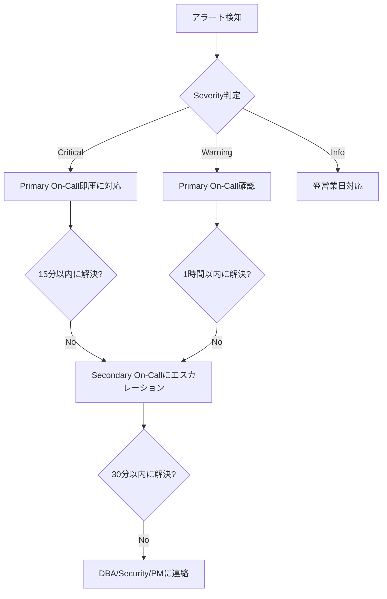

# 運用手順書（Runbook）

- バージョン: 1.0
- 作成日: 2025年12月30日
- 最終更新日: 2025年12月30日
- 作成者: Project Manager

---

## 1. 概要

本ドキュメントは、勤怠管理システムの日常運用手順、障害対応フロー、バックアップ・リストア手順を定義する。運用担当者が迅速かつ確実にシステムを管理できるよう、具体的な手順とコマンドを記載する。

---

## 2. 連絡先・エスカレーション

### 2.1. 緊急連絡先

| 役割 | 担当者 | 連絡先 | 対応時間 |
|------|-------|--------|---------|
| **Primary On-Call** | DevOps Engineer | oncall@example.com / Slack: @oncall | 24/7 |
| **Secondary On-Call** | Backend Engineer | backend-oncall@example.com | 24/7 |
| **Database Administrator** | DBA | dba@example.com | 平日 9:00-18:00 |
| **Security Team** | Security Engineer | security@example.com | 24/7 |
| **Business Owner** | Product Manager | pm@example.com | 平日 9:00-18:00 |

### 2.2. エスカレーションフロー



---

## 3. 日次運用タスク

### 3.1. 毎朝の確認事項（9:00）

#### チェックリスト

```bash
#!/bin/bash
# daily-morning-check.sh

echo "========================================="
echo "Daily Morning Check - $(date)"
echo "========================================="

# 1. システムヘルスチェック
echo -e "\n[1] System Health Check"
curl -s https://api.example.com/health | jq .

# 2. バッチ処理結果確認
echo -e "\n[2] Batch Job Status (Last 24h)"
psql -h $DB_HOST -U $DB_USER -d attendance_prod <<EOF
SELECT
    job_name,
    started_at,
    ended_at,
    status,
    success_count,
    failure_count
FROM batch_job_histories
WHERE started_at > NOW() - INTERVAL '24 hours'
ORDER BY started_at DESC;
EOF

# 3. エラーログ確認
echo -e "\n[3] Error Log Count (Last 24h)"
aws logs filter-log-events \
    --log-group-name /ecs/attendance-api-prod \
    --start-time $(date -d '24 hours ago' +%s)000 \
    --filter-pattern '[level = ERROR]' \
    | jq '.events | length'

# 4. ディスク使用率確認
echo -e "\n[4] Database Disk Usage"
psql -h $DB_HOST -U $DB_USER -d attendance_prod <<EOF
SELECT
    pg_size_pretty(pg_database_size('attendance_prod')) AS db_size;
EOF

# 5. Prometheusアラート確認
echo -e "\n[5] Active Alerts"
curl -s http://prometheus:9090/api/v1/alerts | jq '.data.alerts[] | select(.state=="firing")'

echo -e "\n========================================="
echo "Morning Check Complete"
echo "========================================="
```

#### 結果の記録

確認結果を以下のSlackチャンネルに投稿:
- `#daily-ops-report`

**投稿例**:
```
【日次ヘルスチェック】2025-12-30 09:00
✅ システム: 正常
✅ バッチ処理: CalendarSyncJob (成功: 50件), SheetSyncJob (成功: 10件)
⚠️  エラーログ: 3件（要確認）
✅ ディスク使用率: 45%
✅ アクティブアラート: 0件
```

---

### 3.2. 日中の監視（随時）

#### Grafanaダッシュボード監視

**URL**: https://grafana.example.com/d/attendance-api

**監視項目**:
1. **リクエスト数/秒** - 急激な増減がないか
2. **エラー率** - 1%以下を維持
3. **P95レスポンス時間** - 500ms以下を維持
4. **DB接続プール使用率** - 80%以下を維持

#### 異常検知時のアクション

| 異常 | 閾値 | アクション |
|------|------|----------|
| エラー率上昇 | > 5% | エラーログを確認、必要に応じてロールバック |
| レスポンス時間悪化 | P95 > 1秒 | スロークエリログ確認、DBインデックス確認 |
| トラフィック急増 | 通常の3倍以上 | Auto Scaling確認、必要に応じて手動スケール |
| DB接続プール枯渇 | > 90% | アプリケーション再起動、DB接続リーク調査 |

---

### 3.3. 夕方の確認事項（18:00）

```bash
#!/bin/bash
# daily-evening-check.sh

echo "========================================="
echo "Daily Evening Check - $(date)"
echo "========================================="

# 1. 本日の給与計算実行回数
echo -e "\n[1] Payroll Calculation Count (Today)"
curl -s http://prometheus:9090/api/v1/query \
    --data-urlencode 'query=increase(payroll_calculation_total[1d])' \
    | jq '.data.result[0].value[1]'

# 2. カレンダー同期成功率
echo -e "\n[2] Calendar Sync Success Rate (Today)"
curl -s http://prometheus:9090/api/v1/query \
    --data-urlencode 'query=sum(increase(calendar_sync_success[1d])) / (sum(increase(calendar_sync_success[1d])) + sum(increase(calendar_sync_failure[1d])))' \
    | jq '.data.result[0].value[1]'

# 3. リソース使用状況
echo -e "\n[3] Resource Usage"
aws cloudwatch get-metric-statistics \
    --namespace AWS/ECS \
    --metric-name CPUUtilization \
    --dimensions Name=ServiceName,Value=attendance-api-service \
    --start-time $(date -u -d '1 hour ago' +%Y-%m-%dT%H:%M:%S) \
    --end-time $(date -u +%Y-%m-%dT%H:%M:%S) \
    --period 3600 \
    --statistics Average

echo -e "\n========================================="
echo "Evening Check Complete"
echo "========================================="
```

---

## 4. 障害対応フロー

### 4.1. 障害対応の基本原則

1. **迅速な初動** - アラート受信後、5分以内に状況確認開始
2. **影響範囲の特定** - どのユーザー/機能が影響を受けているか
3. **一時対処の優先** - 完全な原因究明より、まずサービス復旧
4. **コミュニケーション** - Slackで状況を随時共有
5. **事後分析** - 復旧後、必ずポストモーテム実施

### 4.2. 障害レベル定義

| レベル | 定義 | 対応時間 | 例 |
|--------|------|---------|-----|
| **P0 (Critical)** | 全ユーザーがサービス利用不可 | 即座 | API完全ダウン、DB障害 |
| **P1 (High)** | 一部機能が利用不可 | 30分以内 | 給与計算エラー、バッチ失敗 |
| **P2 (Medium)** | パフォーマンス劣化 | 2時間以内 | レスポンス遅延 |
| **P3 (Low)** | 軽微な問題 | 翌営業日 | ログ警告、軽微なバグ |

---

### 4.3. 障害シナリオ別対応手順

#### シナリオ1: APIが応答しない（P0）

**症状**:
- ヘルスチェックが失敗
- すべてのエンドポイントが504 Gateway Timeout
- Prometheusアラート: `APIDown`

**対応手順**:

```bash
# 1. 状況確認
echo "Step 1: Checking API status"
curl -v https://api.example.com/health

# 2. ECSタスクの状態確認
echo "Step 2: Checking ECS tasks"
aws ecs describe-services \
    --cluster attendance-prod-cluster \
    --services attendance-api-service

# 3. タスクログ確認
echo "Step 3: Checking recent logs"
aws logs tail /ecs/attendance-api-prod --since 10m

# 4. タスクが起動していない場合 → 強制的に新しいタスク起動
echo "Step 4: Force new deployment"
aws ecs update-service \
    --cluster attendance-prod-cluster \
    --service attendance-api-service \
    --force-new-deployment

# 5. タスクが起動しているがヘルスチェック失敗 → アプリケーションログ確認
echo "Step 5: Checking application errors"
aws logs filter-log-events \
    --log-group-name /ecs/attendance-api-prod \
    --start-time $(date -d '30 minutes ago' +%s)000 \
    --filter-pattern '[level = ERROR]'

# 6. それでも復旧しない → 前バージョンにロールバック
echo "Step 6: Rollback to previous version"
aws ecs update-service \
    --cluster attendance-prod-cluster \
    --service attendance-api-service \
    --task-definition attendance-api-prod:$(($CURRENT_REVISION - 1))
```

**Slack通知テンプレート**:
```
🚨 P0 Incident: API Down

Status: Investigating
Started: 2025-12-30 10:15
Impact: All users cannot access the system
Actions Taken:
- [10:15] Confirmed API is down
- [10:17] Checking ECS task status
- [10:20] Force new deployment initiated
Next Steps: Monitor task startup
ETA: 10 minutes
```

---

#### シナリオ2: データベース接続エラー（P0）

**症状**:
- アプリケーションログに `could not acquire connection`
- Prometheusアラート: `DatabaseConnectionPoolExhausted`
- APIは起動しているがすべてのリクエストが500エラー

**対応手順**:

```bash
# 1. DB接続確認
echo "Step 1: Check DB connectivity"
psql -h $DB_HOST -U $DB_USER -d attendance_prod -c "SELECT 1;"

# 2. 接続数確認
echo "Step 2: Check active connections"
psql -h $DB_HOST -U $DB_USER -d attendance_prod <<EOF
SELECT
    count(*) AS total_connections,
    count(*) FILTER (WHERE state = 'active') AS active_connections,
    count(*) FILTER (WHERE state = 'idle') AS idle_connections
FROM pg_stat_activity
WHERE datname = 'attendance_prod';
EOF

# 3. ロングランニングクエリ確認
echo "Step 3: Check long-running queries"
psql -h $DB_HOST -U $DB_USER -d attendance_prod <<EOF
SELECT
    pid,
    now() - pg_stat_activity.query_start AS duration,
    state,
    query
FROM pg_stat_activity
WHERE state != 'idle'
  AND now() - pg_stat_activity.query_start > interval '1 minute'
ORDER BY duration DESC;
EOF

# 4. 必要に応じてロングランニングクエリを強制終了
echo "Step 4: Kill long-running queries (if needed)"
# psql -h $DB_HOST -U $DB_USER -d attendance_prod -c "SELECT pg_terminate_backend(PID);"

# 5. アプリケーション再起動（接続プールリセット）
echo "Step 5: Restart application"
aws ecs update-service \
    --cluster attendance-prod-cluster \
    --service attendance-api-service \
    --force-new-deployment

# 6. DB接続数上限の確認・調整
echo "Step 6: Check DB max_connections"
psql -h $DB_HOST -U $DB_USER -d attendance_prod -c "SHOW max_connections;"
```

**根本原因の調査**:
- コネクションリークの有無を確認
- `HikariCP`設定を見直し（`maximum-pool-size`が適切か）

---

#### シナリオ3: バッチ処理の失敗（P1）

**症状**:
- Prometheusアラート: `CalendarSyncFailureHigh`
- `batch_job_histories`テーブルに失敗記録

**対応手順**:

```bash
# 1. 失敗したバッチの詳細確認
echo "Step 1: Check failed batch job details"
psql -h $DB_HOST -U $DB_USER -d attendance_prod <<EOF
SELECT
    id,
    job_name,
    started_at,
    ended_at,
    status,
    success_count,
    failure_count,
    error_details
FROM batch_job_histories
WHERE status = 'FAILURE'
  AND started_at > NOW() - INTERVAL '24 hours'
ORDER BY started_at DESC
LIMIT 5;
EOF

# 2. Google API認証状態確認
echo "Step 2: Check Google API credentials"
# 手動でGoogle Calendar APIにアクセスしてみる
curl -H "Authorization: Bearer $GOOGLE_ACCESS_TOKEN" \
    https://www.googleapis.com/calendar/v3/users/me/calendarList

# 3. エラーログから詳細確認
echo "Step 3: Check application logs"
aws logs filter-log-events \
    --log-group-name /ecs/attendance-api-prod \
    --start-time $(date -d '2 hours ago' +%s)000 \
    --filter-pattern 'CalendarSyncJob'

# 4. 手動でバッチを再実行
echo "Step 4: Manually trigger batch job"
curl -X POST https://api.example.com/api/v1/admin/batch/calendar-sync \
    -H "Authorization: Bearer $ADMIN_TOKEN"

# 5. Google API障害の場合
# → Google Workspace Status Dashboard確認: https://www.google.com/appsstatus/dashboard/
```

**エスカレーション基準**:
- 3回連続で失敗 → PMに報告（給与計算への影響確認）
- Google API側の障害 → 復旧を待つ、手動データ入力の検討

---

#### シナリオ4: レスポンス時間の悪化（P2）

**症状**:
- Prometheusアラート: `HighResponseTime`
- ユーザーから「遅い」との報告

**対応手順**:

```bash
# 1. 現在のレスポンス時間確認
echo "Step 1: Check current response times"
curl -s http://prometheus:9090/api/v1/query \
    --data-urlencode 'query=histogram_quantile(0.95, sum(rate(http_server_requests_seconds_bucket[5m])) by (le, uri))' \
    | jq '.data.result'

# 2. 遅いエンドポイント特定
echo "Step 2: Identify slow endpoints"
# Grafanaダッシュボードでエンドポイント別レスポンス時間を確認

# 3. スロークエリログ確認
echo "Step 3: Check slow queries"
psql -h $DB_HOST -U $DB_USER -d attendance_prod <<EOF
SELECT
    calls,
    total_exec_time,
    mean_exec_time,
    query
FROM pg_stat_statements
ORDER BY mean_exec_time DESC
LIMIT 10;
EOF

# 4. 現在実行中のクエリ確認
echo "Step 4: Check running queries"
psql -h $DB_HOST -U $DB_USER -d attendance_prod <<EOF
SELECT
    pid,
    now() - pg_stat_activity.query_start AS duration,
    state,
    wait_event_type,
    query
FROM pg_stat_activity
WHERE state = 'active'
  AND datname = 'attendance_prod'
ORDER BY duration DESC;
EOF

# 5. CPU/メモリ使用率確認
echo "Step 5: Check resource usage"
aws cloudwatch get-metric-statistics \
    --namespace AWS/ECS \
    --metric-name CPUUtilization \
    --dimensions Name=ServiceName,Value=attendance-api-service \
    --start-time $(date -u -d '1 hour ago' +%Y-%m-%dT%H:%M:%S) \
    --end-time $(date -u +%Y-%m-%dT%H:%M:%S) \
    --period 300 \
    --statistics Average,Maximum

# 6. 必要に応じてスケールアウト
echo "Step 6: Scale out (if needed)"
aws ecs update-service \
    --cluster attendance-prod-cluster \
    --service attendance-api-service \
    --desired-count 4  # 現在2台の場合
```

**根本原因の調査**:
- N+1クエリの有無
- インデックスが効いているか
- キャッシュが機能しているか

---

#### シナリオ5: ディスク容量不足（P1）

**症状**:
- Prometheusアラート: `DiskSpaceLow`
- ログに `No space left on device`

**対応手順**:

```bash
# 1. ディスク使用状況確認
echo "Step 1: Check disk usage"
df -h

# 2. データベースサイズ確認
echo "Step 2: Check database size"
psql -h $DB_HOST -U $DB_USER -d attendance_prod <<EOF
SELECT
    schemaname,
    tablename,
    pg_size_pretty(pg_total_relation_size(schemaname||'.'||tablename)) AS size
FROM pg_tables
WHERE schemaname NOT IN ('pg_catalog', 'information_schema')
ORDER BY pg_total_relation_size(schemaname||'.'||tablename) DESC
LIMIT 10;
EOF

# 3. 古いログファイル削除
echo "Step 3: Clean up old logs"
find /var/log -name "*.log" -mtime +7 -delete

# 4. 古いデータのアーカイブ
echo "Step 4: Archive old data"
# work_records の1年以上前のデータをS3にアーカイブ
psql -h $DB_HOST -U $DB_USER -d attendance_prod <<EOF
COPY (
    SELECT * FROM work_records
    WHERE created_at < NOW() - INTERVAL '1 year'
) TO STDOUT WITH CSV HEADER;
EOF | gzip > work_records_archive_$(date +%Y%m%d).csv.gz

# S3にアップロード
aws s3 cp work_records_archive_$(date +%Y%m%d).csv.gz \
    s3://attendance-archives/work_records/

# アーカイブ後、DBから削除
psql -h $DB_HOST -U $DB_USER -d attendance_prod <<EOF
DELETE FROM work_records
WHERE created_at < NOW() - INTERVAL '1 year';
EOF

# 5. VACUUM実行（ディスク領域解放）
echo "Step 5: Vacuum database"
psql -h $DB_HOST -U $DB_USER -d attendance_prod -c "VACUUM FULL VERBOSE work_records;"

# 6. ストレージ拡張（最終手段）
echo "Step 6: Extend storage (if needed)"
aws rds modify-db-instance \
    --db-instance-identifier attendance-prod-db \
    --allocated-storage 200  # 現在100GBの場合
```

---

## 5. バックアップ・リストア手順

### 5.1. データベースバックアップ

#### 自動バックアップ（AWS RDS）

**設定**:
- バックアップウィンドウ: 03:00-04:00 JST
- バックアップ保持期間: 7日間
- スナップショット頻度: 毎日

**確認方法**:
```bash
# 最新のバックアップ確認
aws rds describe-db-snapshots \
    --db-instance-identifier attendance-prod-db \
    --query 'DBSnapshots[0].[DBSnapshotIdentifier,SnapshotCreateTime,Status]'
```

#### 手動バックアップ

```bash
#!/bin/bash
# manual-backup.sh

DATE=$(date +%Y%m%d_%H%M%S)
BACKUP_FILE="attendance_prod_backup_${DATE}.dump"

echo "Starting manual backup: $BACKUP_FILE"

# pg_dumpでバックアップ
pg_dump -h $DB_HOST -U $DB_USER -d attendance_prod \
    -F custom -v -f $BACKUP_FILE

# 圧縮
gzip $BACKUP_FILE

# S3にアップロード
aws s3 cp ${BACKUP_FILE}.gz s3://attendance-backups/manual/

# ローカルファイル削除（S3転送成功後）
rm ${BACKUP_FILE}.gz

echo "Backup completed: ${BACKUP_FILE}.gz"
```

**実行タイミング**:
- リリース前
- 重要なデータ変更前
- 月次（月末）

---

### 5.2. データベースリストア

#### 前提条件
- リストア作業は必ずステージング環境で事前テスト
- 本番環境へのリストアは承認プロセス必須

#### 手順

```bash
#!/bin/bash
# restore-database.sh

# 1. リストアするバックアップファイルをダウンロード
BACKUP_FILE="attendance_prod_backup_20251230_030000.dump.gz"

echo "Step 1: Download backup from S3"
aws s3 cp s3://attendance-backups/manual/$BACKUP_FILE .

# 2. 解凍
echo "Step 2: Extract backup"
gunzip $BACKUP_FILE

# 3. 現在のDBをバックアップ（念のため）
echo "Step 3: Backup current database"
pg_dump -h $DB_HOST -U $DB_USER -d attendance_prod \
    -F custom -v -f attendance_prod_before_restore_$(date +%Y%m%d_%H%M%S).dump

# 4. アプリケーション停止
echo "Step 4: Stop application"
aws ecs update-service \
    --cluster attendance-prod-cluster \
    --service attendance-api-service \
    --desired-count 0

# 5. 既存接続を切断
echo "Step 5: Terminate existing connections"
psql -h $DB_HOST -U $DB_USER -d postgres <<EOF
SELECT pg_terminate_backend(pid)
FROM pg_stat_activity
WHERE datname = 'attendance_prod'
  AND pid != pg_backend_pid();
EOF

# 6. データベースを削除・再作成
echo "Step 6: Drop and recreate database"
psql -h $DB_HOST -U $DB_USER -d postgres <<EOF
DROP DATABASE attendance_prod;
CREATE DATABASE attendance_prod;
EOF

# 7. リストア実行
echo "Step 7: Restore database"
pg_restore -h $DB_HOST -U $DB_USER -d attendance_prod \
    -v ${BACKUP_FILE%.gz}

# 8. データ整合性確認
echo "Step 8: Verify data integrity"
psql -h $DB_HOST -U $DB_USER -d attendance_prod <<EOF
SELECT
    'employees' AS table_name, COUNT(*) FROM employees
UNION ALL
SELECT 'work_records', COUNT(*) FROM work_records
UNION ALL
SELECT 'students', COUNT(*) FROM students;
EOF

# 9. アプリケーション再起動
echo "Step 9: Restart application"
aws ecs update-service \
    --cluster attendance-prod-cluster \
    --service attendance-api-service \
    --desired-count 2

# 10. ヘルスチェック
echo "Step 10: Health check"
sleep 60
curl -f https://api.example.com/health || echo "WARNING: Health check failed"

echo "Restore completed"
```

---

### 5.3. アプリケーションコードのロールバック

```bash
#!/bin/bash
# rollback-application.sh

# 1. 現在のタスク定義を確認
CURRENT_REVISION=$(aws ecs describe-services \
    --cluster attendance-prod-cluster \
    --services attendance-api-service \
    --query 'services[0].taskDefinition' \
    --output text | grep -oP '\d+$')

echo "Current revision: $CURRENT_REVISION"

# 2. 前のリビジョンを指定
PREVIOUS_REVISION=$((CURRENT_REVISION - 1))
echo "Rolling back to revision: $PREVIOUS_REVISION"

# 3. ロールバック実行
aws ecs update-service \
    --cluster attendance-prod-cluster \
    --service attendance-api-service \
    --task-definition attendance-api-prod:$PREVIOUS_REVISION

# 4. デプロイ完了を待機
aws ecs wait services-stable \
    --cluster attendance-prod-cluster \
    --services attendance-api-service

# 5. ヘルスチェック
echo "Checking health after rollback..."
curl -f https://api.example.com/health

echo "Rollback completed to revision: $PREVIOUS_REVISION"
```

---

## 6. 定期メンテナンス

### 6.1. 週次メンテナンス（毎週日曜 02:00）

```bash
#!/bin/bash
# weekly-maintenance.sh

echo "========================================="
echo "Weekly Maintenance - $(date)"
echo "========================================="

# 1. データベースVACUUM
echo -e "\n[1] Database VACUUM"
psql -h $DB_HOST -U $DB_USER -d attendance_prod <<EOF
VACUUM ANALYZE;
EOF

# 2. インデックス再構築（必要に応じて）
echo -e "\n[2] Reindex (if needed)"
psql -h $DB_HOST -U $DB_USER -d attendance_prod <<EOF
REINDEX INDEX CONCURRENTLY idx_work_records_employee_time;
EOF

# 3. 統計情報更新
echo -e "\n[3] Update statistics"
psql -h $DB_HOST -U $DB_USER -d attendance_prod <<EOF
ANALYZE;
EOF

# 4. 古いログの削除
echo -e "\n[4] Clean up old logs"
aws logs delete-log-events \
    --log-group-name /ecs/attendance-api-prod \
    --before $(date -d '90 days ago' +%s)000

# 5. 不要なDockerイメージ削除
echo -e "\n[5] Clean up old Docker images"
aws ecr batch-delete-image \
    --repository-name attendance-api-prod \
    --image-ids "$(aws ecr list-images \
        --repository-name attendance-api-prod \
        --filter tagStatus=UNTAGGED \
        --query 'imageIds[?imageDigest!=`null`]' \
        --output json)"

echo -e "\n========================================="
echo "Weekly Maintenance Complete"
echo "========================================="
```

### 6.2. 月次メンテナンス（毎月1日 02:00）

```bash
#!/bin/bash
# monthly-maintenance.sh

echo "========================================="
echo "Monthly Maintenance - $(date)"
echo "========================================="

# 1. データベース完全バックアップ
echo -e "\n[1] Full database backup"
DATE=$(date +%Y%m)
pg_dump -h $DB_HOST -U $DB_USER -d attendance_prod \
    -F custom -v -f attendance_prod_monthly_${DATE}.dump
gzip attendance_prod_monthly_${DATE}.dump
aws s3 cp attendance_prod_monthly_${DATE}.dump.gz s3://attendance-backups/monthly/

# 2. 古いデータのアーカイブ
echo -e "\n[2] Archive old data"
# audit_logs の1年以上前のデータをアーカイブ
psql -h $DB_HOST -U $DB_USER -d attendance_prod <<EOF
COPY (
    SELECT * FROM audit_logs
    WHERE changed_at < NOW() - INTERVAL '1 year'
) TO STDOUT WITH CSV HEADER;
EOF | gzip > audit_logs_archive_${DATE}.csv.gz

aws s3 cp audit_logs_archive_${DATE}.csv.gz s3://attendance-archives/audit_logs/

psql -h $DB_HOST -U $DB_USER -d attendance_prod <<EOF
DELETE FROM audit_logs WHERE changed_at < NOW() - INTERVAL '1 year';
EOF

# 3. セキュリティパッチ適用確認
echo -e "\n[3] Check for security updates"
# 依存ライブラリの脆弱性スキャン
./mvnw dependency-check:check

# 4. SSL証明書有効期限確認
echo -e "\n[4] Check SSL certificate expiration"
echo | openssl s_client -servername api.example.com \
    -connect api.example.com:443 2>/dev/null | \
    openssl x509 -noout -dates

# 5. パフォーマンスレポート生成
echo -e "\n[5] Generate performance report"
# Grafanaから先月のメトリクスをエクスポート
# → 手動で確認し、Slack #monthly-reportに投稿

echo -e "\n========================================="
echo "Monthly Maintenance Complete"
echo "========================================="
```

---

## 7. セキュリティインシデント対応

### 7.1. 不正アクセス検知時の対応

**症状**:
- 不明なIPアドレスからの大量アクセス
- 認証失敗の急増
- 異常なデータ変更

**対応手順**:

```bash
# 1. 疑わしいIPアドレスをブロック
echo "Step 1: Block suspicious IP"
# WAF ルールを追加
aws wafv2 update-ip-set \
    --scope REGIONAL \
    --id $WAF_IP_SET_ID \
    --addresses 192.0.2.1/32

# 2. 該当IPからのアクセスログ確認
echo "Step 2: Check access logs"
aws logs filter-log-events \
    --log-group-name /ecs/attendance-api-prod \
    --filter-pattern '[ip = "192.0.2.1"]' \
    --start-time $(date -d '24 hours ago' +%s)000

# 3. 影響を受けたユーザーの特定
echo "Step 3: Identify affected users"
psql -h $DB_HOST -U $DB_USER -d attendance_prod <<EOF
SELECT DISTINCT employee_id, changed_at
FROM audit_logs
WHERE ip_address = '192.0.2.1'
ORDER BY changed_at DESC;
EOF

# 4. 該当ユーザーのセッション無効化
echo "Step 4: Invalidate sessions"
# Redis からセッション削除
redis-cli DEL "session:user:123"

# 5. パスワードリセット通知
echo "Step 5: Notify users to reset password"
# メール送信スクリプト実行

# 6. セキュリティチームにエスカレーション
echo "Step 6: Escalate to security team"
# Slack #security-incidents に報告
```

---

## 8. ポストモーテム（事後分析）

### 8.1. ポストモーテムテンプレート

**障害報告書**

```markdown
# Incident Report: [障害タイトル]

## 基本情報
- **発生日時**: 2025-12-30 10:15 JST
- **検知日時**: 2025-12-30 10:17 JST
- **復旧日時**: 2025-12-30 10:45 JST
- **総影響時間**: 30分
- **Severity**: P0 (Critical)
- **対応者**: @oncall, @backend-engineer

## 概要
APIが30分間完全にダウンし、すべてのユーザーがサービスを利用できなかった。

## タイムライン
- **10:15** - Prometheusアラート `APIDown` 発報
- **10:17** - On-Call担当者がSlackで確認開始
- **10:20** - ECSタスクが起動していないことを確認
- **10:22** - 強制的に新規デプロイを実行
- **10:30** - 新しいタスクが起動するも、ヘルスチェック失敗
- **10:35** - アプリケーションログから `OutOfMemoryError` を発見
- **10:38** - タスク定義のメモリを2GB→4GBに増加
- **10:42** - 再デプロイ、正常に起動
- **10:45** - ヘルスチェック成功、復旧確認

## 根本原因
アプリケーションのメモリリークにより、JVMヒープメモリが枯渇し、`OutOfMemoryError`が発生した。

## 影響範囲
- **影響を受けたユーザー**: 全ユーザー（約50名）
- **影響を受けた機能**: すべての機能
- **データ損失**: なし

## 対処内容
- タスク定義のメモリを2GB→4GBに増加
- JVMヒープダンプを取得し、メモリリークの原因を調査中

## 再発防止策
1. [ ] メモリリークの原因を特定し、修正（担当: @backend, 期限: 2026-01-05）
2. [ ] JVMメモリ使用量のアラートを追加（担当: @devops, 期限: 2026-01-02）
3. [ ] ヘルスチェックに `/actuator/health` だけでなく `/metrics` も追加（担当: @devops, 期限: 2026-01-03）

## 良かった点
- アラート検知から対応開始まで2分と迅速だった
- ログから原因を特定できた

## 改善点
- メモリ監視が不十分だった
- ヘルスチェックがアプリケーションの内部状態を検知できなかった
```

---

## 9. よくある質問（FAQ）

### Q1: バッチ処理を手動で実行したい

```bash
# CalendarSyncJobを手動実行
curl -X POST https://api.example.com/api/v1/admin/batch/calendar-sync \
    -H "Authorization: Bearer $ADMIN_TOKEN"

# SheetSyncJobを手動実行
curl -X POST https://api.example.com/api/v1/admin/batch/sheet-sync \
    -H "Authorization: Bearer $ADMIN_TOKEN"
```

### Q2: 特定ユーザーのセッションを強制ログアウトさせたい

```bash
# Redisからセッション削除
redis-cli DEL "session:user:${EMPLOYEE_ID}"

# またはPostgreSQLから削除（セッションをDBで管理している場合）
psql -h $DB_HOST -U $DB_USER -d attendance_prod <<EOF
DELETE FROM user_sessions WHERE employee_id = ${EMPLOYEE_ID};
EOF
```

### Q3: Google API の認証をリフレッシュしたい

```bash
# 該当従業員のリフレッシュトークンを削除（再認証を促す）
psql -h $DB_HOST -U $DB_USER -d attendance_prod <<EOF
UPDATE employees
SET google_refresh_token_encrypted = NULL
WHERE id = ${EMPLOYEE_ID};
EOF
```

---

## 10. まとめ

本運用手順書により、以下を実現する:

1. ✅ **日次運用の標準化**: 朝・夕の確認作業を効率化
2. ✅ **迅速な障害対応**: シナリオ別の具体的な手順で復旧時間を短縮
3. ✅ **確実なバックアップ**: 自動・手動バックアップで データ保護
4. ✅ **計画的なメンテナンス**: 週次・月次メンテナンスでシステムを健全に保つ
5. ✅ **継続的な改善**: ポストモーテムで再発防止

運用担当者がこの手順書に従うことで、安定したシステム運用が実現できる。
